#Azure Function to retrieve a secret from Azure Key Vault using nodejs

<span style="color:grey">Published on 05/08/2019</span>

> nodejs solution using `azure-keyvault` `ms-rest-azure`

There are often times when you want to store a token or a connection string in a safe location in the cloud to be accessed by your application safely. I recently worked on an app which uses a token to consume an api and although you can store this in different ways, you might want to secure it in a way you can control their distribution and make sure it is not freely available to be meddled with.

**Azure Key Vault** helps solve this problem by safely securing and tighlty controlling your access tokens, passwords, certificates, API keys and other secrets.

I have seen few articles and blogs on using C# functions or web apps which interact with Azure Key Vault, but it was a bit of a pain to get it finally working in `NodeJs` with so much getting changed with respect to npm packages or documentation. I decided to write an Azure Function which was fairly generic to retrieve secret I want to use in my applications.

This also opens up the possibilty to do many other actions with Key Vault objects like setting values as well.

The SDK for node [key-vault-node-getting-started](https://github.com/Azure-Samples/key-vault-node-getting-started/blob/master/index.js) is a great place to start but I had a different login mechanism. I wanted to use `loginWithServicePrincipalSecret` which uses app registration in Azure AD so we can pass clientid, secret and domain/tenant guid to authenticate.

Here is a simplified but working version of an Azure Function which uses the above mechanism to retrieve secrets from Azure Key Vault.

### Create Azure Key Vault & Secret

Create an Azure Key Vault if not already created. Add a secret you want to retrieve later using Azure Function.
I don't have to elaborate the documentation for this here is pretty much up to date [Key Vault - Quick create through portal](https://github.com/MicrosoftDocs/azure-docs/blob/master/articles/key-vault/quick-create-portal.md)

### Create an Azure Function 

Create a basic nodejs Azure Function , see steps below

In Azure portal, search for Function App, create

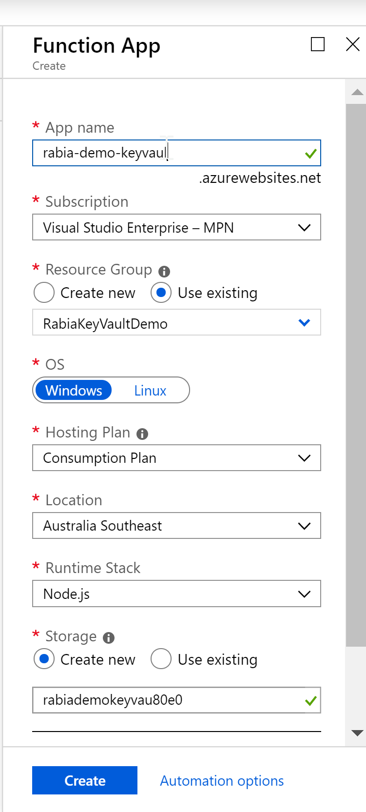

Now add a new function , I have set up my visual studio code with Azure extension which allows me to add new functions from the application, feel free to use cli if that suits you.

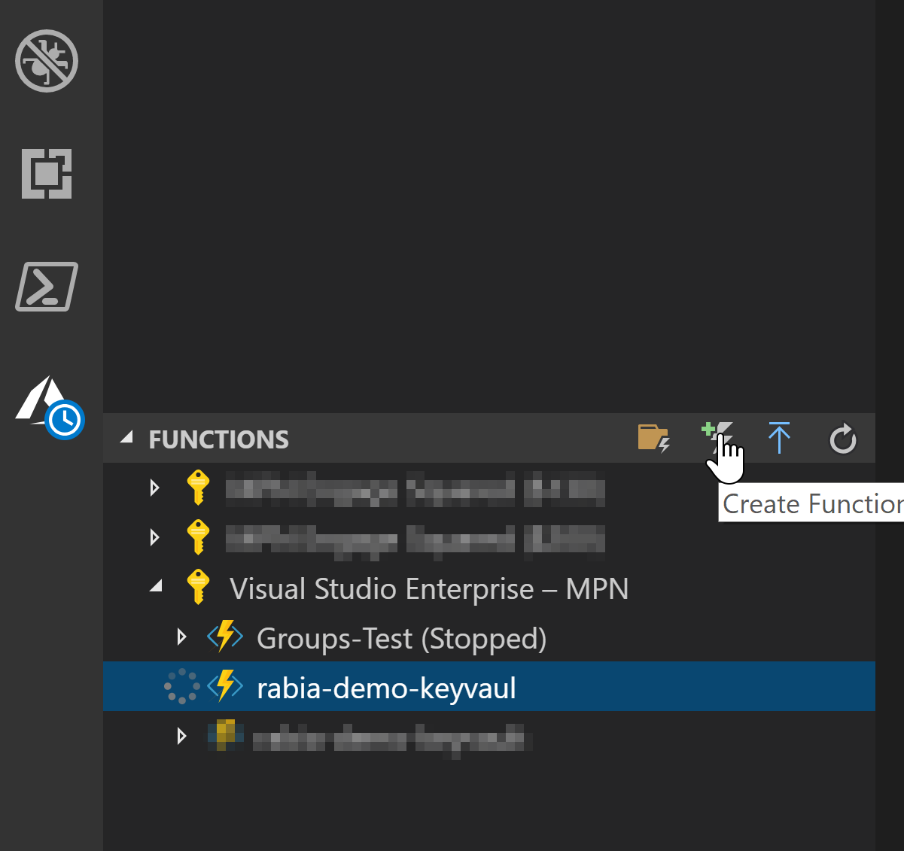

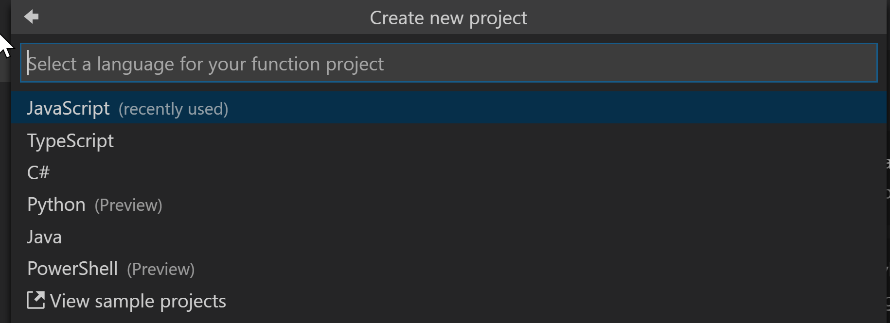

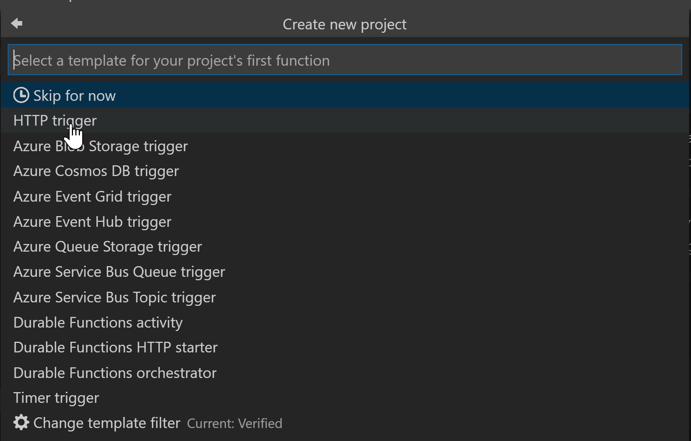

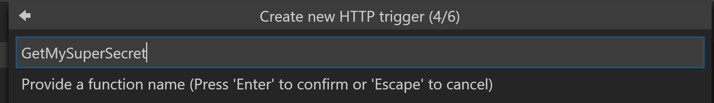

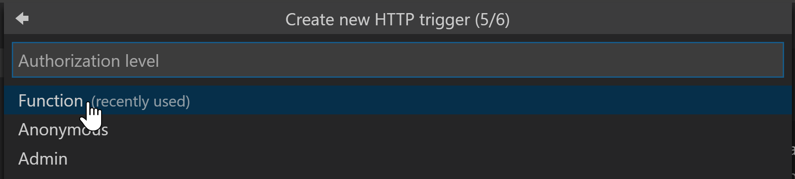


This is now a basic function which was provided by the scaffolding, let's work with this for now for setting up communication between the Azure Function and the Key Vault.

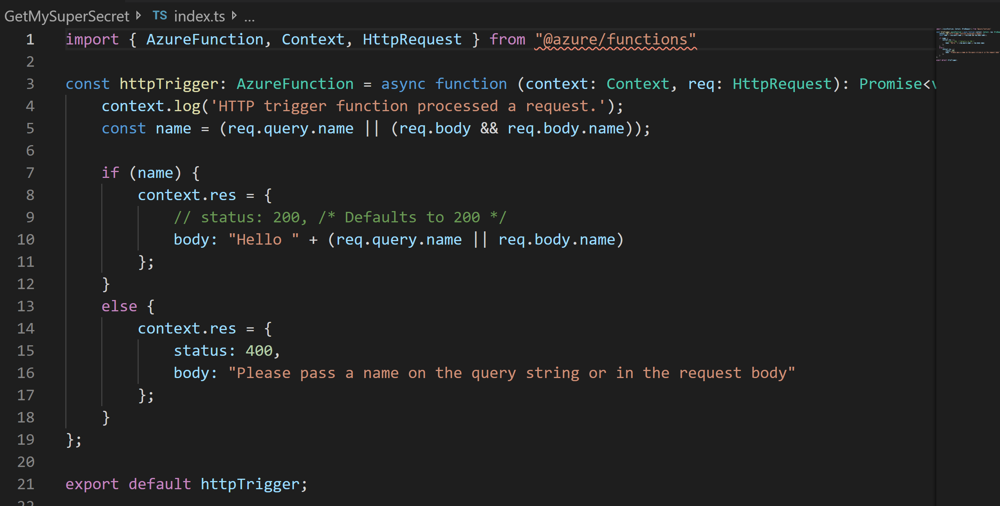

Deploy this function and then let us get back to the portal for further configurations.

### Set up Service Principal in AAD

Since I am using `loginWithServicePrincipalSecret` authentication mechanism , I need to set it up.
Create a new application in Azure Active directory, here `Rabia-App-Key-Vault`
Make a note of Client ID, Tenant ID and create a Secret and make a note of it too. We will need this later in the function.

[howto-create-service-principal-portal](https://docs.microsoft.com/en-us/azure/active-directory/develop/howto-create-service-principal-portal/?WT.mc_id=m365-0000-rwilliams)

### Access policy in Key Vault

We need to update the access policy in Azure Key Vault which gives our newly registered app in AAD access to read or write anything in Key Vault.

You can select what permissions you grant the app from below screen.

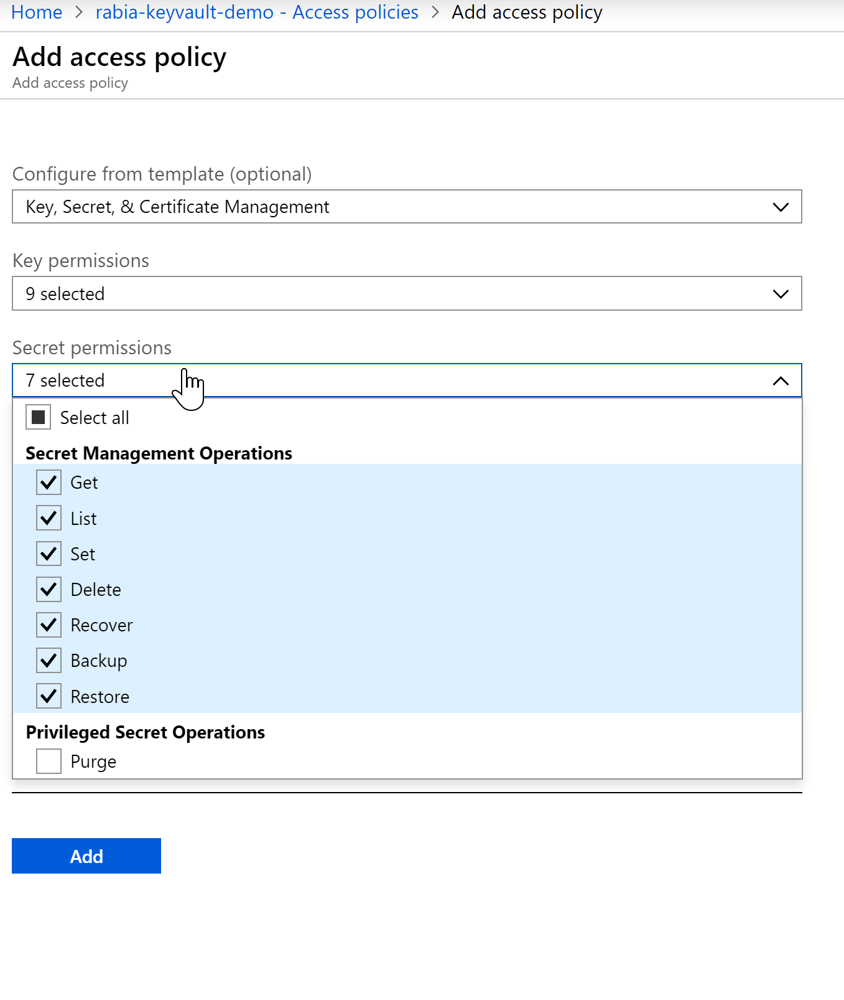

See how the Principal chosen is the Service Principal we set up in AAD here `Rabia-App-Key-Vault`

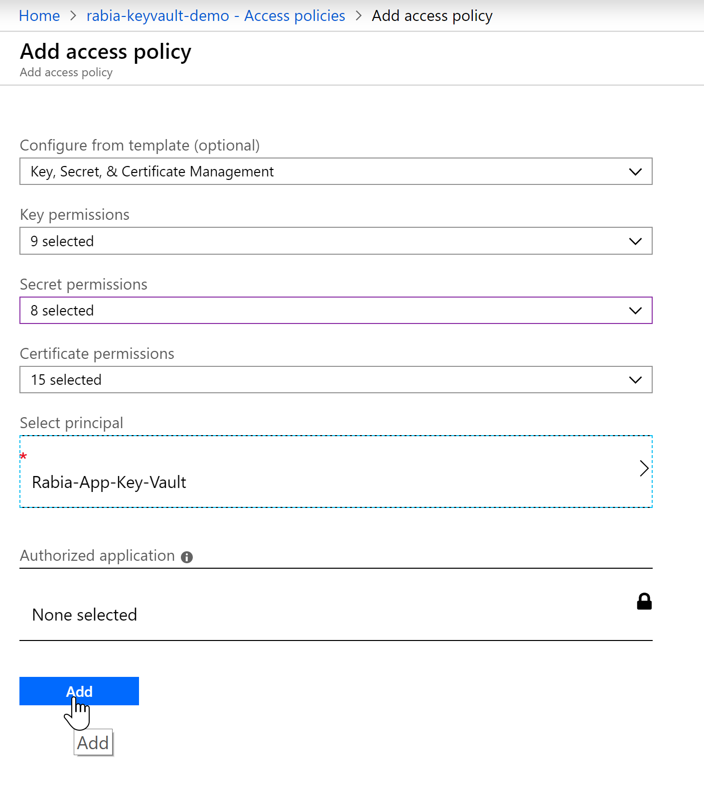

With this we have established all the necessary wiring needed between `Azure Function -> AAD App -> Key Vault`.

Azure function will use AAD app to authenticate and it will be able to communicate with the KeyVault since it has access to get secrets from it.

### Update the Azure function with code to get Secret from Key Vault

Here is the code snippet for the Azure Function.

```
import { AzureFunction, Context, HttpRequest } from "@azure/functions";
import * as KeyVault from 'azure-keyvault';
import * as msrestazure from "ms-rest-azure";


var clientId = <clientidfromAAD>;
var clientSecret = <clientsecretfromAAD>;
var tenantId = <tenantidfromAAD>
//move the version as parameter in the Azure function
var secretVersion = <secretVersionfromAzureKeyVault>;

const httpTrigger: AzureFunction = async function (context: Context, req: HttpRequest): Promise<void> {
    context.log('Get My Super Secret function processed a request.');
    const secretname = (req.query.secretname || (req.body && req.body.secretname));

    if (secretname) {
        //authenticate using AAD
        let credentials = await msrestazure.loginWithServicePrincipalSecret(clientId, clientSecret, tenantId);
        //convert to KeyVaultCredentials : this area threw errors while following the SDK, had to convert the //credentials to successfully pass it to KeyVaultClient
        let keyVaultCredentials = new msrestazure.KeyVaultCredentials(null, credentials);
        const keyVaultClient = new KeyVault.KeyVaultClient(keyVaultCredentials);
        var vaultUri = "https://xxx-keyvault-demo.vault.azure.net/";
        let response = await keyVaultClient.getSecret(vaultUri, secretname, secretVersion);
        context.log("Successfully retrieved my secret");
        context.res = {
            body: JSON.stringify(response)
        };
        context.done(null, response);
    }
    else {
        context.res = {
            status: 400,
            body: "Please pass a secretname on the query string or in the request body"
        };
    }
};

export default httpTrigger;
```

Secret Version can be found where you have created the secret.
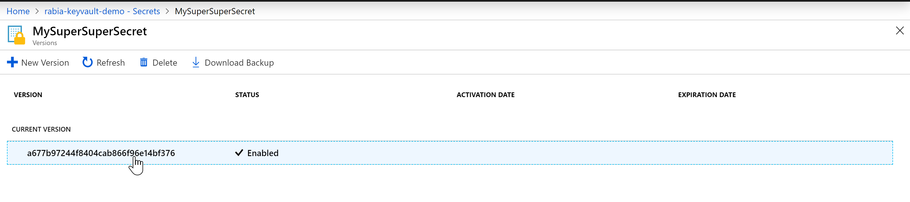

Now after deploying the updated code, let's access our Azure function from a browser, get the function URL from the portal and append `&secretname=<insertyoursecretname>` into the url

here is the result often the value holds the secret value.

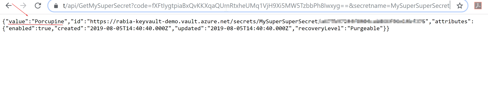

Happy azuring your way to safety and security :) #shareingiscaring

<!-- Global site tag (gtag.js) - Google Analytics -->
<script async src="https://www.googletagmanager.com/gtag/js?id=UA-146817327-1">
</script>
<script>
  window.dataLayer = window.dataLayer || [];
  function gtag(){dataLayer.push(arguments);}
  gtag('js', new Date());

  gtag('config', 'UA-146817327-1');
</script>


