#Azure Deployment Gates

Published on 22/2/2019

What makes project releases stress free?
There is no perfect answer for this question if you have been in the IT industry for quite a long time.
Sure you cannot make everything perfect but you can always add a little control over things, thanks to Azure DevOps!
Today we we look into that one extra step called [Deployment Gates](https://docs.microsoft.com/en-us/azure/devops/pipelines/release/approvals/gates?view=azure-devops/?WT.mc_id=m365-0000-rwilliams) which you could configure and apply into your release pipelines to control your deployments further. 

##Deployment Gates

###So what are deployment gates?
I am going to compare this concept with the Gates at the airport. 
You have checked in, your id is verified and you proceed to the gates to board your flight. Sure you have been checked and verified before but the airline staff checks your ticket and make sure one last time before you proceed to your flight.
Deployment gates are similar. It is an extra check done to make sure everything is in place before proceeding to the next stage in your deployment.

It needs no manual interventions, you are entrusting logic to determine whether the health signals for this stage is monitored and verified to proceed to the next stage
You can enable these gates at the start of a stage called *Pre-deployment gate* or at the end called *Post-deployment gate*

There are four types of gates available at this point in which I will be demonstrating *Query Work items*
The four types are:

- Invoke Azure function: Trigger execution of an Azure function and ensure a successful completion. For more details, see [Azure function task](https://docs.microsoft.com/en-us/azure/devops/pipelines/tasks/utility/azure-function?view=azure-devops/?WT.mc_id=m365-0000-rwilliams).
- Query Azure monitor alerts: Observe the configured Azure monitor alert rules for active alerts. For more details, see [Azure monitor task](https://docs.microsoft.com/en-us/azure/devops/pipelines/tasks/utility/azure-monitor?view=azure-devops/?WT.mc_id=m365-0000-rwilliams).
- Invoke REST API: Make a call to a REST API and continue if it returns a successful response. For more details, see [HTTP REST API task](https://docs.microsoft.com/en-us/azure/devops/pipelines/tasks/utility/http-rest-api?view=azure-devops/?WT.mc_id=m365-0000-rwilliams).
- Query Work items: Ensure the number of matching work items returned from a query is within a threshold. For more details, see [Work item query task](https://docs.microsoft.com/en-us/azure/devops/pipelines/tasks/utility/work-item-query?view=azure-devops).
Let's cut to the chase and see a step by step process of how to configure the gate and how it works!

I am assuming that you already have a project in Azure DevOps with build and release already set up without deployment gates.
You should have necessary permissions to make changes to release pipelines.

​I have a super simple release pipeline which takes my project's SPFx web part solution package and deploys it to a SharePoint app catalogue. I do not have any approvals in place since this is purely my dev space and would recommend approvals to go hand in hand with deployment gates for actual release pipelines. Read more here on [approvals](https://docs.microsoft.com/en-us/azure/devops/pipelines/release/approvals/approvals?view=azure-devops/?WT.mc_id=m365-0000-rwilliams).

Let's get started. Below is my release pipeline.

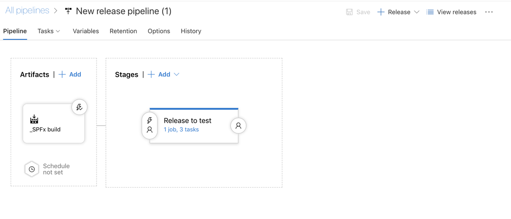

I have decided to put some control into my release but at the same time I want it to be some external service that decides for me at this point if it is okay to release this new version of the app into my dev tenancy.
I am going to go for a Pre-deployment gate, so I will click on the user icon on the left of my stage as shown below. 
If you want to add a Post-deployment gate click on the user icon on the right (this is when you have other stages after this stage)

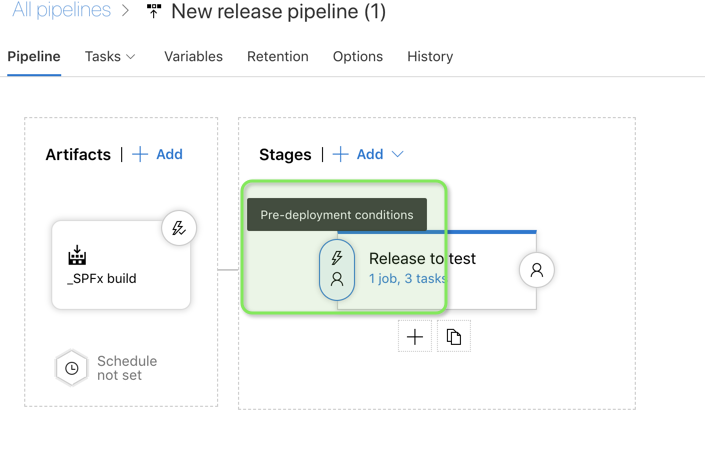

On clicking the icon, the right panel opens up, scroll through and Enable gates as shown below

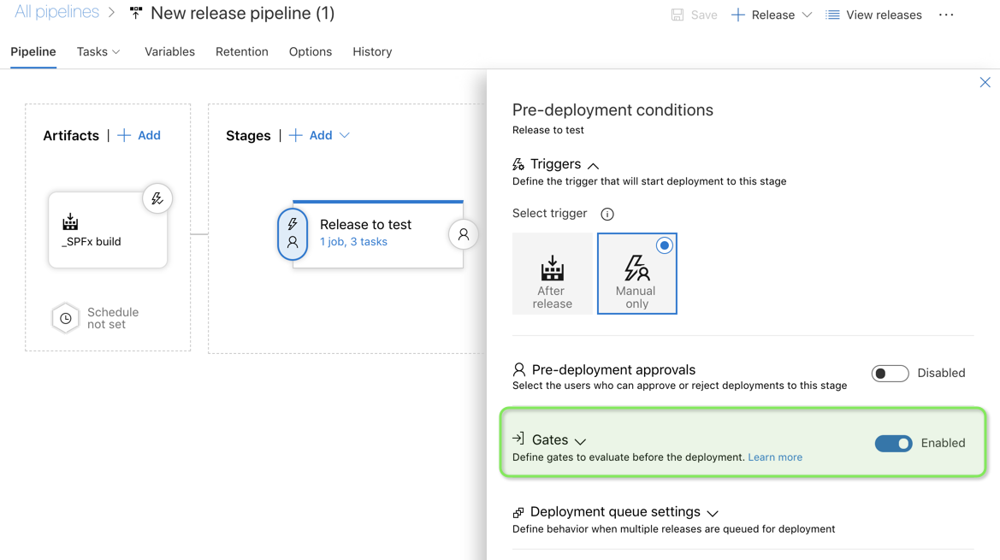

Now we need to tell the enabled Gates what to check. Like I mentioned before I am going to use the type -Query Work items.
 I have already created a query called Active bugs , check out [this post](https://docs.microsoft.com/en-us/azure/devops/boards/queries/using-queries?view=azure-devops) to see how to create queries in Azure DevOps
 This query checks if there are any open bugs in the project as shown below

 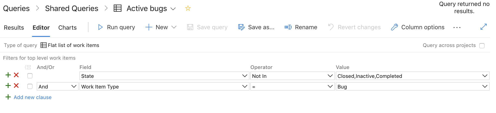

 The idea is , I control my release to ensure that there are no open bugs at the time this build is released. Fair, I think .
Now let's go back to the Release and make sure this query is configured to the gates.

 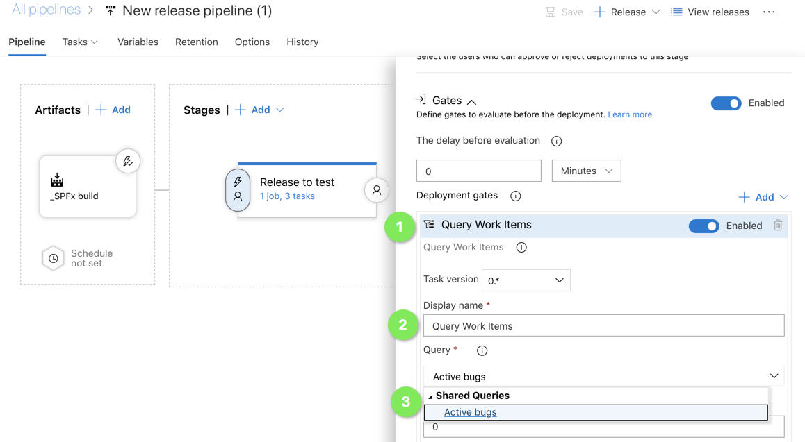

 There are some other configurations like threshold limit for the query both upper and lower, time out when gate fails , evaluation time etc which can be read in detail [here](https://docs.microsoft.com/en-us/azure/devops/pipelines/release/approvals/gates?view=azure-devops#define-a-gate-for-a-stage/?WT.mc_id=m365-0000-rwilliams).
​Below are the setting for my demo.

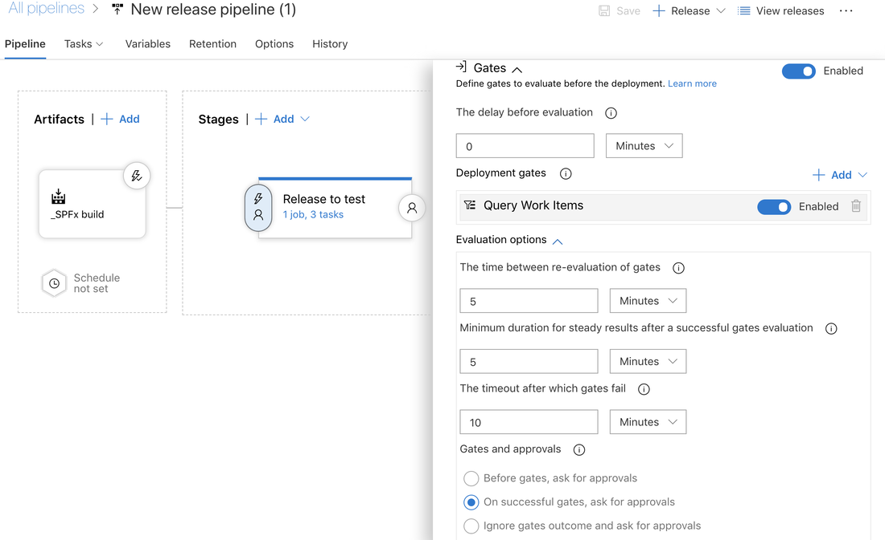

 We will see first how it works in a perfect world where my query returns no results and then see how it works when it fails.
​
I have kicked off a release and below you can see how it proceeds step by step.
​
The release has kicked off and waiting for a manual trigger (I have set it this way , but you can also make it an automatic trigger)

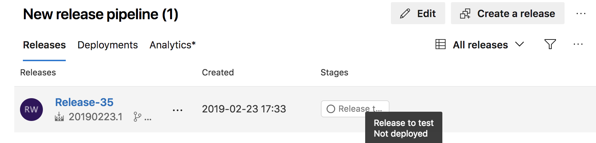

 I have deployed (or performed the trigger) so now it is processing the gates

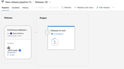

  The pre deployment gates have succeeded as I have zero open bugs and the condition is satisfied for the release to proceed

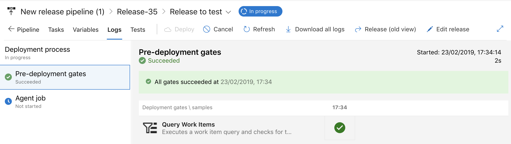

The release is also succeeded and it's all looking good

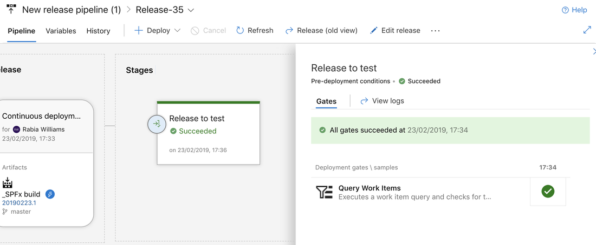

Imagine if the conditions were not met and there was a sneaky bug that got away and was not closed. How can we ensure that our process is working in our favour. Let's look at the `not so perfect` scenario
​
I now have an active bug in the project and it shows in my query as well, see below

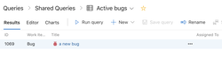

Now I have kicked off another build and its release but only this time I expect my release to not proceed.
At the gates it should fail the condition. It will retry until the time out is reached and eventually fail if the conditions remain the same.

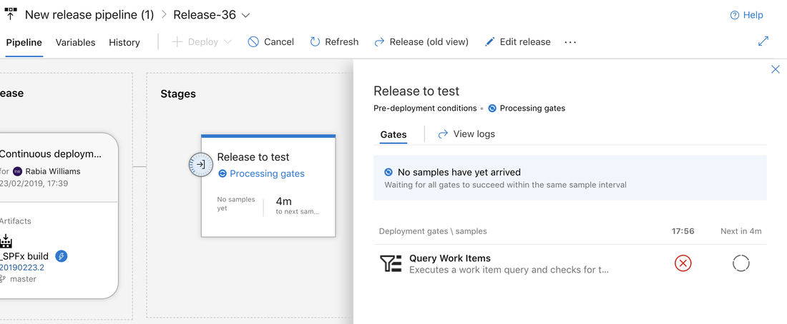

So it's time to take control over your release and play with the gates in Azure DevOps. I will be exploring more in this space so stay tuned.

