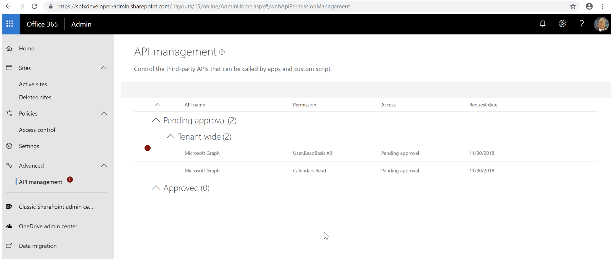

#Grant API Permissions using Office 365 CLI

<span style="color:grey">Published on 12/2/2018</span>

Recently, I developed a web part that uses Microsoft Graph Rest API which gets information from Outlook of the current logged in user and displays them on home page of the intranet.
I created an SPFX web part using REACT and within hours spun up a new web part. It was easy peasy thanks to Yeoman generator and the awesome samples in GitHub
After deploying my app solution into the App Catalogue however there was this annoying step that had to be done.
Grant API Permission to the web part to use certain APIs.


If you go to the API management window, you will see the access request for it which you have to approve so the webpart can use these APIs


##The Problem
Fine, for now we will approve this permission and everything will work perfectly (although it may not seem so obvious at first but we just granted permission for these APIs on a tenant level and not just for the solution we deployed) . Well, living on the edge for now and it's all good.
But this permission request saga does not end here. Each time you deploy a package, roll out a fix etc, this list keeps on growing with access permission requests. Although you don't really have to action it, it will keep on growing this list.

Now that's inconvenient and if you have OCD like me, this growing list will make you sleepless until you finally get used to it.
Another way to avoid this step altogether is to grant access on a tenant level and avoid having those permission request bits in your web part.
Again all this feels a bit hack-y if you ask me.

##The Saviour- Office 365 CLI
The latest version of the Office 365 CLI  let you grant API permission more easily. Here is how. 

```
o365  spo serviceprincipal grant add --resource 'Microsoft Graph' --scope 'Mail.Read'
```

You can install Office 365 CLI latest version by executing 

```
npm install -g @pnp/office365-cli@next
```

##Solution Specific API Permission 
If you thought it would have been nicer to have permissions granted only at the solution level and not tenant level then say no more..
[Isolated Web parts](https://blog.mastykarz.nl/grant-api-permissions-office-365-cli/#isolated-web-parts) might just be right for you. Read more about this capability to grant API permissions on a solution level thanks to the original post on the same topic by one of my heroes in SharePoint Waldek Mastykarz

