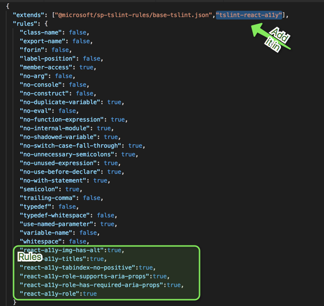
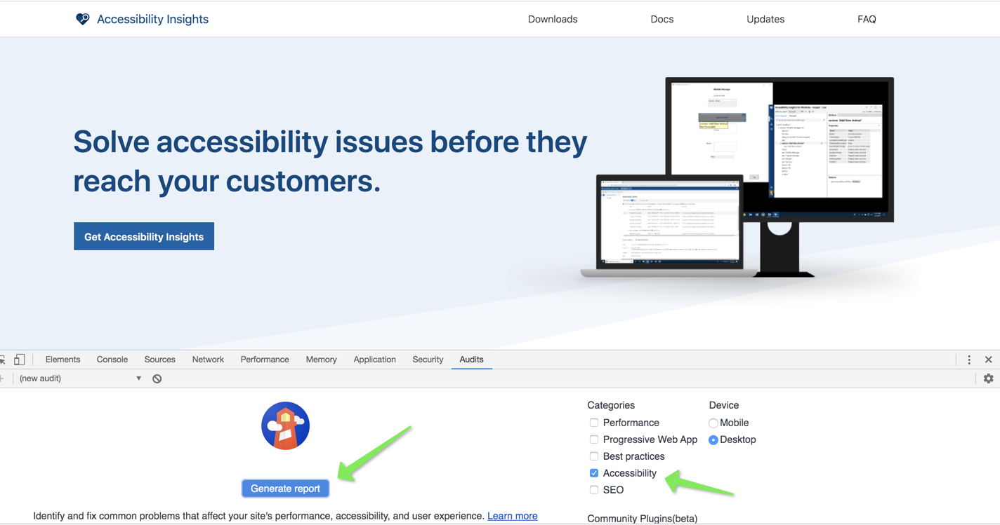
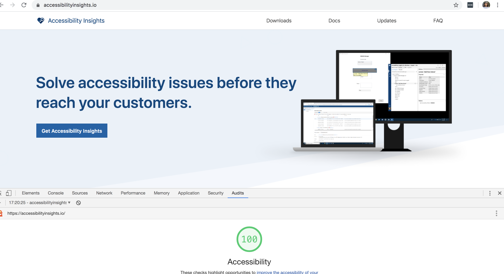
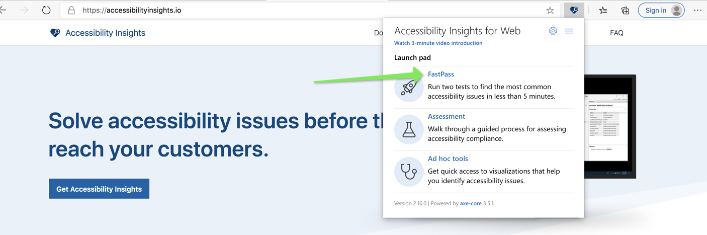
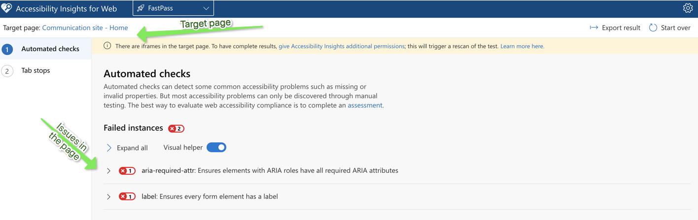
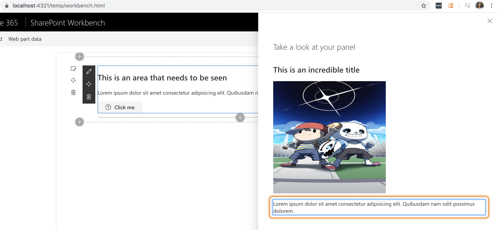

#Web accessibility (also referred to as a11y)  in React components

<span style="color:grey">Published on 19/04/2020</span>

Accessibility of a web component is the assumption that the component is available and usable to all. 
As developers we often forget what `all` is.

Google defines accessibility as below


> Accessibility, then, refers to the experience of users who might be outside the narrow range of the "typical"  user, who might access or interact with things differently than you expect. Specifically, it concerns users who are experiencing some type of impairment or disability — and bear in mind that that experience might be non-physical or temporary.

Recently I have been working on making SPFx react components accessible and below I will share some of the insights, tools and tips that I have learnt so far. I will update this blog as I find more around this, or work on more challenging aspects. But in general it felt great to work on this, as I know deep down I am making a difference no matter how small.

###Using ARIA

All aria-* HTML attributes are fully supported in JSX, although you might be familiar that React dom elements usually have camelCased attributes.

Commonly used, aria attributes below

| Attribute        | Description           |
| ------------- |:-------------:|
| `aria-label` | gives an alternative accessible name for an element for a person who uses screen readers. |
|`aria-hidden` | removes that element and all of its children from the accessibility tree.  |
|`aria-required`| if set true, let's users know it is required field |

### Use more React.Fragments than div
The more we break away from html semantic the more we have to adjust our component to be accessible.
e.g adding layers of div in your component can make accessibility complicated.

In react use [React.Fragments](https://reactjs.org/docs/fragments.html) instead to group logically similar element, this avoids adding nodes into the DOM unecessarily.


###Programmatically setting focus

To set focus in React, we can use Refs to DOM elements mostly because DOM elements are always manipulated in React and sometimes focus is lost.
React provides a feature known as refs that allow for DOM access from components.
You can use React.createRefs() _from React 16.3_ for focusable elements in react and then manipulate or focus on these elements at will when state changes and loses focus.

```
private ref = React.createRef();
....

public componentDidMount() {
     ref.current.focus(); //set focus 
  }

...

render(){
<input  type="text" ref={ref} />
 
}

```

To focus on a div specify the type , or you will get `Type 'RefObject<{}>' is not assignable to type 'RefObject<HTMLDivElement>' ` error.

```
private ref = React.createRef<HTMLDivElement>();
```

###Mouse events

Always check your mouse events without a mouse, and simply by using keyboard navigation and press enter/space to activate your element (like a button)

Resort to `OnFocus` and `OnBlur` events as you write your click events, to assist any malfunctions if we solely depend on a click event.

###Navigation

Align and give tabIndex={0} to the elements in your components in the order you visualise them for users to navigate through them.

> Giving a tabIndex value greater than zero is a bad practice. 

If you have tabIndex={0} and an aria-label along with it, then consider that element focusable and readable.

You dont need to give these attributes to div's that is not to be focused, you can leave them as is. Screen readers will pick elements that have `tabIndex` and `aria-label`

If tabIndex={0} is used to make elements focusable, the keyboard interaction must be correct for that element, e.g if role="button" then it should be activated if we use `Enter`/ `Space bar`

A tabIndex={-1} value removes the element from the default navigation flow and also allows it to receive programmatic focus, e.g a hidden modal.

For lists usually you can use arrows to navigate e.g a [Pivot](https://developer.microsoft.com/en-us/fluentui#/controls/web/pivot) in fluent UI

Checkboxes are always selected using the `Space bar`


###Images with alt text

If you have images in your components, give an alternate text to let the user know there is an image.
And when you do this, make sure it makes sense to the user 
check below eg.

alt="Credit card logos accepted images"  (Meh)

alt="Master card logo, Amex card logo" (Righ on!)


### My tools

For any development to be successful you need tools to help and guide you.

**Intellisense checks**
In my projects I used [tslint-react-a11y](https://github.com/joaovieira/tslint-react-a11y) which was pretty straight forward to set up and configure rules.
My tslint.json looks like this for all my basic checks.




**Dev tools**

- **Chrome (Audit tab)** in developer tools (first step to understand the problems)

Open your dev tools (F12) and go to the `Audit` tab to generate the report.


And here is a generated report.


**Browser extensions**

- [Accessibility insights](https://accessibilityinsights.io/) is a great extension

Download and add the extension to Chrome/Edge browser.
Open the page you want to check accessibilt and click on `fast pass`



It then generated a comprehensive report on the issues in the current iframe.


You can also check tab orders in your form using this extension which shows you the tab order from one element to another.

This extension can help you fixe almost all of the main issues.

**Screen readers** play a huge part. You can use below based on what your clients use or even check if things are fully accessible as the web interface behaves differently when you switch on the screen readers.

- NVDA
- JAWS (I use demo version which needs your laptop to restart every 40 min 😞)
- ChromeVox chrome extension [http://www.chromevox.com/installing.html](http://www.chromevox.com/installing.html)

Check how chrome vox even uses an orange focus around what it is reading.



### A Source code to show accessible webpart vs non accessible web

See for your self the experience when you do not use a mouse and try to close your eyes and navigate.

This really opens your mind on how much of a difference you can make to someone's productivity.

Here is the source code to clone, switch between the non accessible component and accessible component and compare your experience.

[https://github.com/rabwill/react-accessibility](https://github.com/rabwill/react-accessibility)


> This blog will be updated with more details as I learn more, watch this space.


<!-- Global site tag (gtag.js) - Google Analytics -->
<script async src="https://www.googletagmanager.com/gtag/js?id=UA-146817327-1">
</script>
<script>
  window.dataLayer = window.dataLayer || [];
  function gtag(){dataLayer.push(arguments);}
  gtag('js', new Date());

  gtag('config', 'UA-146817327-1');
</script>

