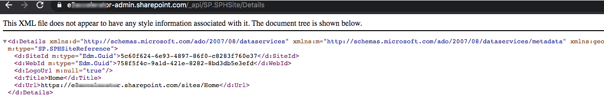

#SharePoint Rest API to retrieve your tenant's Home Site Details 

<span style="color:grey">Published on 07/01/2020</span>

**SharePoint Home Site** which is a fairly new concept, is basically a landing site for your organization.

There can be one Home Site per tenant, read more about SharePoint Home Sites [here](https://www.microsoft.com/en-au/microsoft-365/blog/2019/05/21/sharepoint-home-sites-microsoft-365-innovations-intelligent-workplace/?WT.mc_id=m365-0000-rwilliams)

Home Site can now be set, removed or retrieved using Powershell or [Office365 CLI](https://pnp.github.io/office365-cli/) commands.

If you want to programmatically get the Url or any basic information of the Home Site in your tenant using code you can do so by making a rest call (`GET` to be specific).

Here is the reference from [sp-rest-explorer](https://s-kainet.github.io/sp-rest-explorer/#/entity/SP.SPHSite) for the API.

I have a site in my tenant `https://yourtenant.sharepoint.com`, See below rest Url that should be used in your rest call to get Home site details.

```
https://yourtenant.sharepoint.com/_api/SP.SPHSite/Details

```

 Any site in your tenant , even the tenant admin url can be used along with the rest api path  `/_api/SP.SPHSite/Details` to retrieve the home site details. 

The result when I have just passed the rest url on my browser.

 

Here you can see the result when I make the call, the details retrieved are -
 
 - SiteId (Site Guid)
 - WebId (Web Guid)
 - LogoUrl (If any set)
 - Title (Title of the home site)
 - Url (Url of the home site)


<!-- Global site tag (gtag.js) - Google Analytics -->
<script async src="https://www.googletagmanager.com/gtag/js?id=UA-146817327-1">
</script>
<script>
  window.dataLayer = window.dataLayer || [];
  function gtag(){dataLayer.push(arguments);}
  gtag('js', new Date());

  gtag('config', 'UA-146817327-1');
</script>

