#Step by Step: Create SPFx library component

<span style="color:grey">Published on 19/3/2019</span>

So the new SPFx 1.8 is here and what is so exciting about this version is the ability to create Library components.
Imagine having your custom library hosted in the tenant for re-use? I am pretty excited about this although it is in preview when this blog is written.
Without much intro let's get into creating one, shall we?

##My Library - Circle-Lib
I am going to create a math library for circles which has two functions 

- area - calculates the area of a circle when  radius is passed as the argument
- perimeter - calculates the perimeter of a circle when a radius is passed as the argument

First step is scaffolding the library component, just like you would create a Webpart or Extension; we can now create Libraries, but by using an extra argument in the yo command called **--plusbeta**

```
​ yo @microsoft/sharepoint --plusbeta
```

Assuming that you already have the sharepoint generator installed before running above command.
If you don't not to worry,  use below command before you use the yo command 
```
npm install @microsoft/generator-sharepoint
```

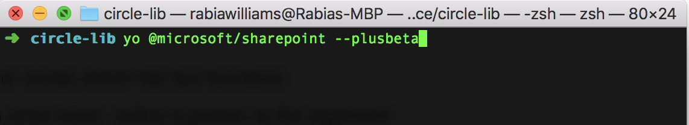

Now let's start scaffolding , solution name and other input is given and then choose Library ​option for component type (wohoo!)

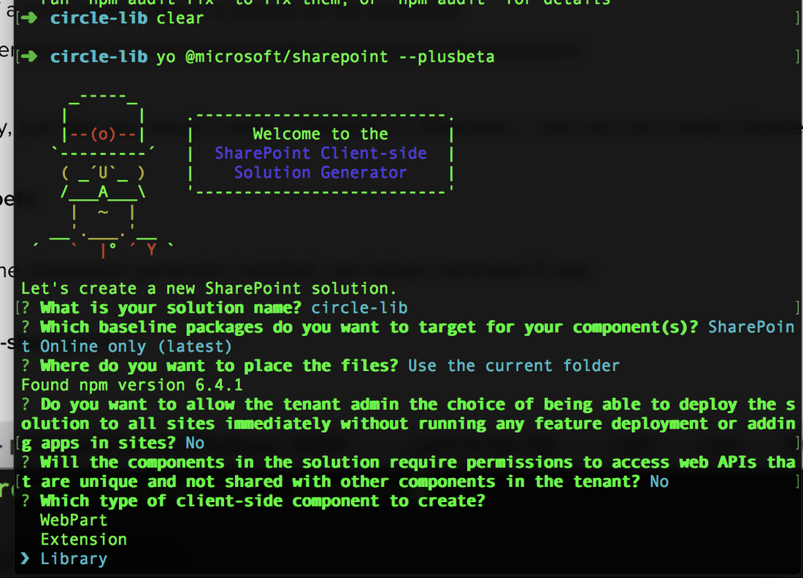

I call my component CircleMathLibrary and the scaffolding continues..
Now the solution looks very similar to our webpart and extension with a TS file for our new library and its functions.
​
We can add functions as we like, here I will create my math functions- area and parameter

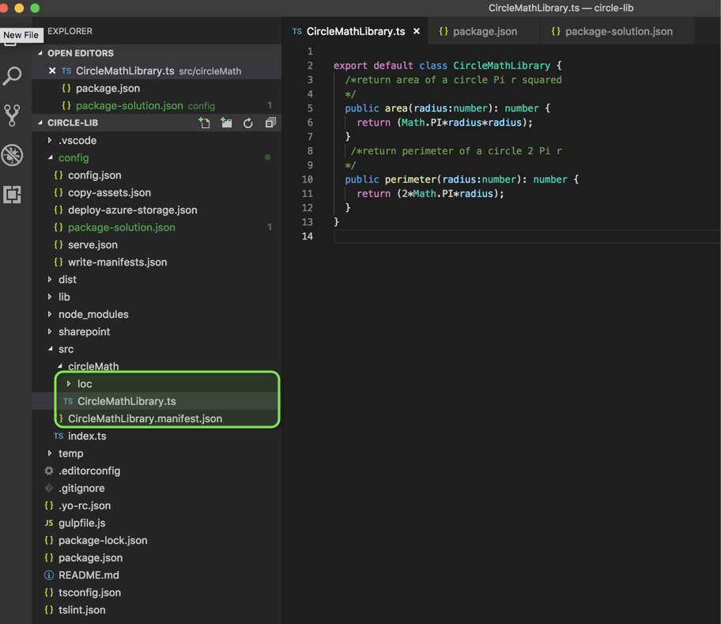

In my *package-solution.json* file I will add below item to deploy the solution tenant wide (I will come back to this a little later)
**skipFeatureDeployment**: true

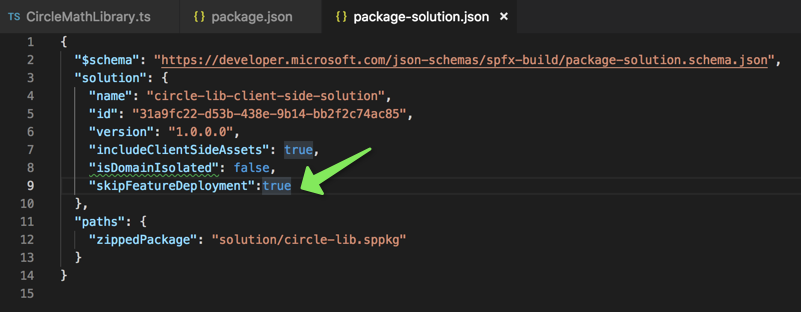


Now let's use **npm link** command from the root of your library folder;  to create a local npm link to the library locally (this will be useful when we develop our webpart but I will explain it a little bit more as we get to the webpart.

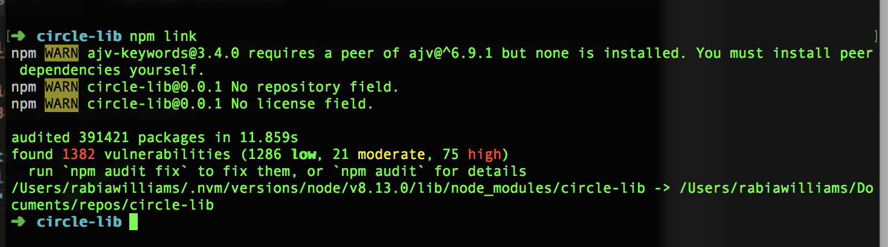

##My Webpart - circle
Now let us create a new webpart which will then consume this library (I am going with a no framework webpart using SPFx 1.8.0)
I am assuming this to be a little repeated step so would link steps to create a basic SPFx webpart here 
####Now how would you link the library you created to this webpart?????####
You just have to use below command from your webpart root folder and then use the dependencies and references as you would treat an npm package.
```
npm link circle-lib
```

circle-lib is the name of my library in package.json file

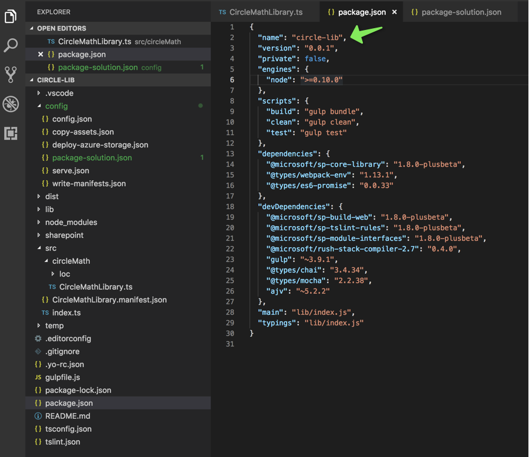

So I am now in my webpart folder and will run the link command

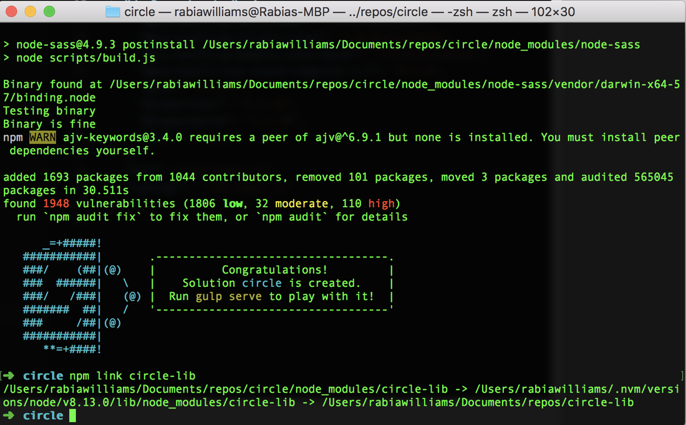

Now in the webpart add dependencies in *package.json* file for the new library

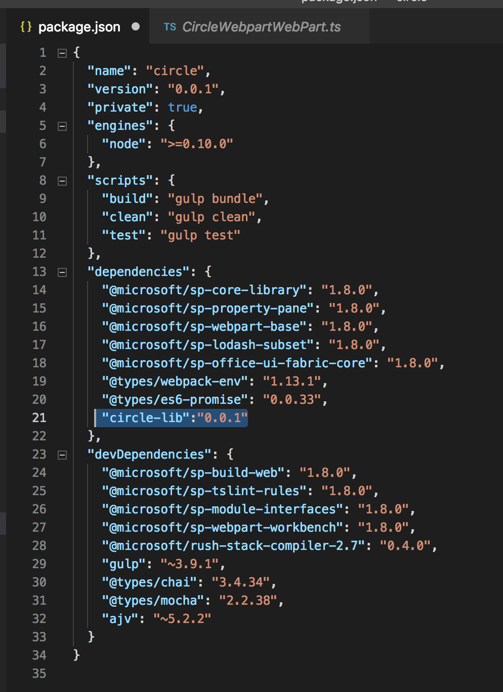

Now let's import the library in the webpart page and use it as usual, notice how referencing the library did not throw an error, it's the npm link 

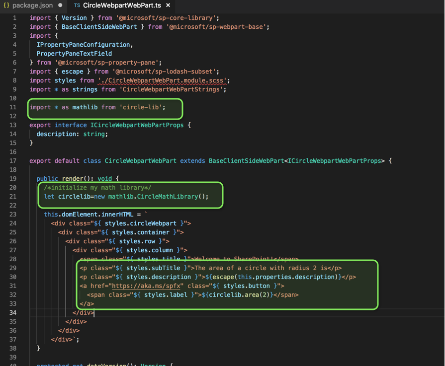

Let's build and serve to test it locally

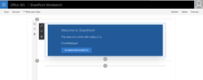


##How to deploy and use the library in your SPO tenant?
We need to package and deploy the solution of the library into app catalog as you would normally do for a webpart or an extension using below command.

```
gulp bundle --ship
gulp package-solution --ship
```

Note that the solution should be deployed globally in the tenant and there are some considerations
- You can only host one library component version at the time in a tenant
- It is not supported to have other component types included in a solution which contains library component
- You will need to reference library component type during development time from a package manager or using npm link to be able to bundle solutions which are dependent on it (which we already did)

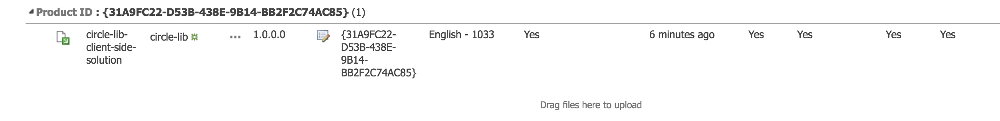

I have the library packaged and deployed in the app catalog.
I would now package my webpart and deploy it as well into the app catalogue.

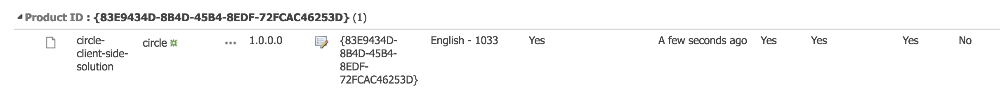

Install the webpart app (add the app) into the site

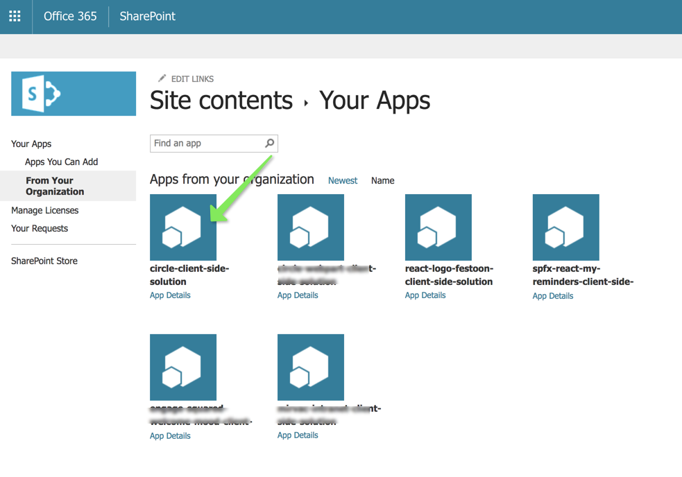

Add the webpart to a page

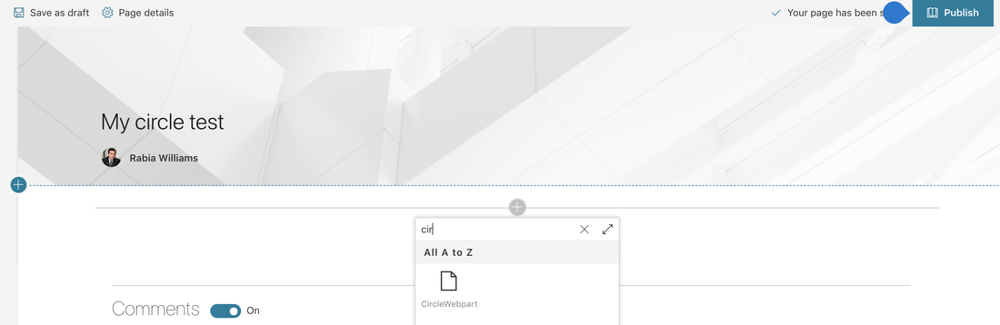

And everything is looking good, the webpart is referring to the library component deployed in the app catalog


Hope this helps someone who is looking into SPFx library component today ! Enjoy

###References
- [https://docs.microsoft.com/en-us/sharepoint/dev/spfx/library-component-overview](https://docs.microsoft.com/en-us/sharepoint/dev/spfx/library-component-overview/?WT.mc_id=m365-0000-rwilliams)