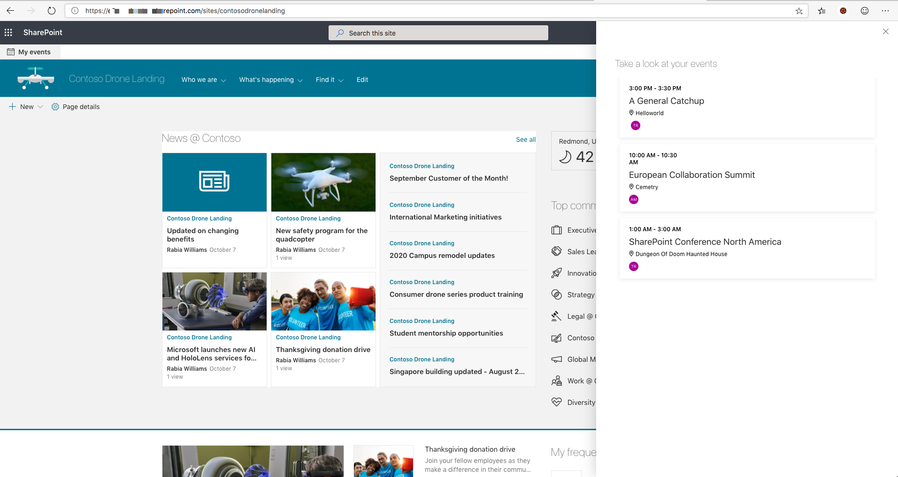

#SPFx Application customizer to display agenda using Microsoft Graph Toolkit

Published on 15/10/2019

Recently [Microsoft Graph Toolkit](https://developer.microsoft.com/en-us/graph/blogs/the-microsoft-graph-toolkit-is-now-generally-available/?WT.mc_id=m365-0000-rwilliams) went GA and I thought this is the perfect time to explore/read about the toolkit and what it offers.

A nice set of UI components with M365 look and feel readily availbale which integrates with Microsoft Graph, multiple providers for seemless authentication and templating options for the components are the prime attractions in the toolkit.

A very detailed first look can be found in this blog by [Sergei Sergeev](https://spblog.net/post/2019/10/01/exploring-microsoft-graph-toolkit), one of my favourite technical bloggers.

## My Events Application customizer

I have quickly created an SPFx Application customizer in under 30 mintues to get the below component up and running and I have not touched the UX part of it!

How easy was that?

I have used the `SharePointProvider` to connect to the toolkit and the rest is very similar to any other react SPFx component I have created in the past.

###Pros
- Easy to use components
- M365 look and feel 
- Seemless Authentication 
- [Custom templating](https://docs.microsoft.com/en-gb/graph/toolkit/templates/?WT.mc_id=m365-0000-rwilliams)

###Issues/Unknowns
- Typescript will throw an error when trying to use a component in tsx. The workaround is to define the custom element in code. [Read here](https://docs.microsoft.com/en-gb/graph/toolkit/overview#react-typescript-and-tsx)
- Unclear on whether React components can be used inside templates 

### Source code
Find source code to  `My events` application customizer here [https://github.com/rabwill/msgraph-myagenda-panel](https://github.com/rabwill/msgraph-myagenda-panel)
Once you package and upload solution to the app catalog make sure you approve all requested permissions from the [API Management](https://docs.microsoft.com/en-us/sharepoint/dev/spfx/use-aadhttpclient?ranMID=24542&ranEAID=je6NUbpObpQ&ranSiteID=je6NUbpObpQ-kmj9w4KuU7fheOHCKW_QGw&epi=je6NUbpObpQ-kmj9w4KuU7fheOHCKW_QGw&irgwc=1&OCID=AID2000142_aff_7593_1243925&tduid=(ir__1joce3raiwkfr0enkk0sohzw0m2xgmanrw0ckbro00)(7593)(1243925)(je6NUbpObpQ-kmj9w4KuU7fheOHCKW_QGw)()&irclickid=_1joce3raiwkfr0enkk0sohzw0m2xgmanrw0ckbro00#manage-permission-requests) in the admin center.
Clone the source and try it yourself. #sharingiscaring

<!-- Global site tag (gtag.js) - Google Analytics -->

