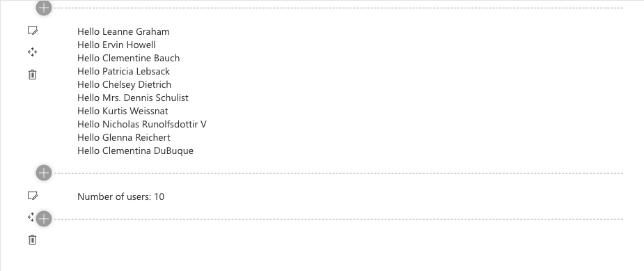

#React Reusable Custom Hooks in SPFx

<span style="color:grey">Published on 05/03/2020</span>

In recent versions of SPFx, React 16.8 is supported. React hooks are used from functional component and not the standard SPFx generated class components.
So not advising rewriting all components to have hooks, but potentially usable for any new development.

I have understood these concepts from blogs by [Vardhaman]('https://www.vrdmn.com/2020/02/spfx-using-react-hooks-to-globally.html') and open source projects by [Garry](https://github.com/garrytrinder/spfx-servicescopes-hooks) so not going into details about hooks but here is a good [study material](https://reactjs.org/docs/hooks-overview.html)

Here we are going to look into **Custom hooks** typically used for reusable stateful logic between multiple components and how to use them in an SPFx webpart.

Building your own Hooks lets you extract component logic into reusable functions(they are basically functions with a fancy name used in React)

## What our code does

### React components

In our example today we will look at two SPFx React webparts 

- GetUsers
- UserCount

These components share a logic to get users.

Our goal here is to remove any logic that is duplicated (we could use a common service but remember we are learning about `hooks` here ) 
So we create a custom hook, which retrieves user data from a sample api `https://jsonplaceholder.typicode.com/users`

Not only have I set the state but I have also returned the value , so now this is just like a function that I can reuse.

### The custom hook

```
const url='https://jsonplaceholder.typicode.com/users';
function useGetUsers(){
    const [data, setName] = useState({users:[]});
    useEffect(() => {         
       axios.get(url).then(response=>{
        setName({users: response.data});
        });      
        
    }, []);
return data;    
}

```
This custom hook can now be used in GetUsers component as

```
const Getusers: React.FunctionComponent<{}> = () => {
    const usrs = useGetUsers();
    return (
        <div>
            {usrs.users.map(x =>
                <div>
                    Hello  {x.name}
                </div>
            )}
        </div>
    );
};
```

And the same one used in the UserCount component

```
const CountUsers: React.FunctionComponent<{}> = () => {
  const usrs = useGetUsers();
  return (
    <div>
      Number of users:  {usrs.users.length}
    </div>
  );
};
```

And my two webparts loaded displaying the info from the same hook.
 

#### Some basic pointers

- Custom hooks resue stateful logic, they do not share the state

- Each call to a Hook gets an independant state

- It is a good practice to name your hooks with a prefix - `use`

[Find full source here](https://github.com/rabwill/reusable-hooks)

Hope you had some fun reading this and I really do hope you can apply this in your own projects.

<!-- Global site tag (gtag.js) - Google Analytics -->
<script async src="https://www.googletagmanager.com/gtag/js?id=UA-146817327-1">
</script>
<script>
  window.dataLayer = window.dataLayer || [];
  function gtag(){dataLayer.push(arguments);}
  gtag('js', new Date());

  gtag('config', 'UA-146817327-1');
</script>


