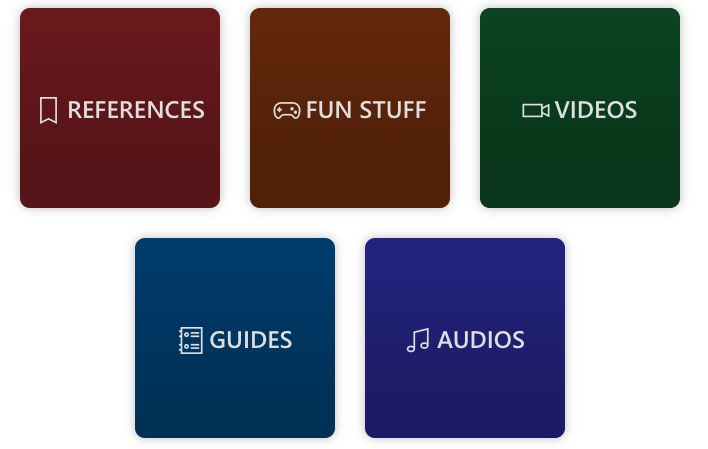
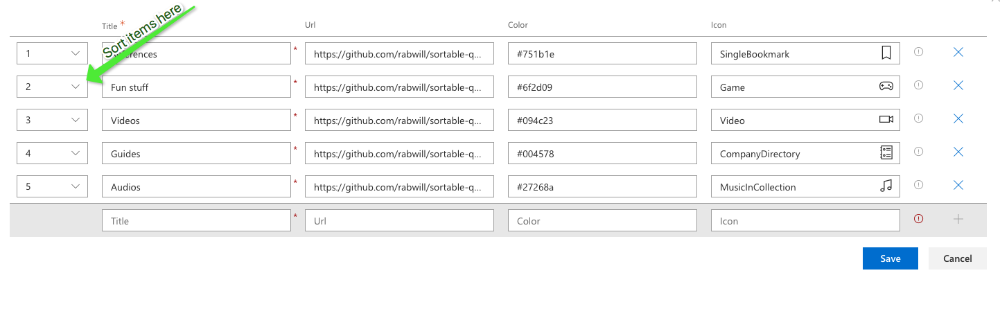
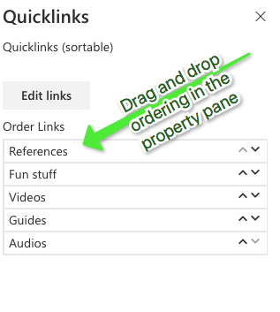

# PropertyFieldOrder for easy ordering of quicklinks

<span style="color:grey">Published on 04/04/2020</span>

Clients love quicklinks and we already know 100 different ways to implement customized quicklinks webpart using `SPFx`.

One of the most easy and configurable way to implement a super simple quicklinks webpart without having a SharePoint list as back end, if you ask me is using the PnP spfx property control [PropertyFieldCollectionData](https://sharepoint.github.io/sp-dev-fx-property-controls/controls/PropertyFieldCollectionData/)

Here is a quick one I created



Not only does this property field control gives you the ability to insert data into the webpart's configuration, but it also allows us to order them.



One interesting ask that came with it is to make the ordering experience simple. A simple drag and drop ordering perhaps?

Say no more, PnP spfx property control again to the rescue. We have the [PropertyFieldOrder](https://sharepoint.github.io/sp-dev-fx-property-controls/controls/PropertyFieldOrder/) control will do just that. All you have to do is feed the items in the `PropertyFieldCollectionData` into this property control and now we have a much simpler ordering experience.

Below in my code you can see how I am passing the `this.properties.links` to the `PropertyFieldOrder` 's `items` property.

```
protected getPropertyPaneConfiguration(): IPropertyPaneConfiguration {
    return {
      pages:
        [{header: {
          description: "Quicklinks (sortable)"
        },
          groups:
            [{
              groupFields:
                [PropertyFieldCollectionData('links', {
                  label: "",
                  value: this.properties.links, key: "123",
                  panelHeader: "", panelDescription: "",
                  manageBtnLabel: "Edit links", enableSorting: true,
                  fields: [
                    { id: "title", title: "Title", type: CustomCollectionFieldType.string, required: true },
                    { id: "url", title: "Url", type: CustomCollectionFieldType.url, required: false },
                    { id: "color", title: "Color", type: CustomCollectionFieldType.string, required: false },
                    { id: "icon", title: "Icon", type: CustomCollectionFieldType.fabricIcon, required: false },
                  ]
                }), PropertyFieldOrder("orderedItems", {
                  key: "orderedItems",
                  label: "Order Links",
                  items: this.properties.links,
                  textProperty: "title",
                  properties: this.properties,                 
                  onPropertyChange: this.onPropertyPaneFieldChanged
                })]
            }]
        }]
    };
  }
```

End result of how my property pane looks



I can now simply drag and drop my links to order them.

If you want to try this out here is the [source code](https://github.com/rabwill/sortable-quickLinks)

Make sure you keep an eye on what's available in [PnP SPFx Controls](https://sharepoint.github.io/sp-dev-fx-property-controls/) at all times.There is just too much awesomeness already built for you to make your components even more awesome. Sharing is caring :)

<!-- Global site tag (gtag.js) - Google Analytics -->
<script async src="https://www.googletagmanager.com/gtag/js?id=UA-146817327-1">
</script>
<script>
  window.dataLayer = window.dataLayer || [];
  function gtag(){dataLayer.push(arguments);}
  gtag('js', new Date());

  gtag('config', 'UA-146817327-1');
</script>
