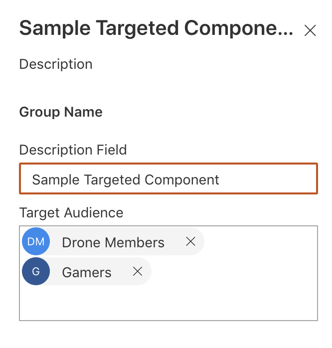

#Reusable Target Audience wrapper based on SharePoint groups for custom SPFx webparts

<span style="color:grey">Published on 29/01/2020</span>

React concepts are interesting and with SPFx development I have been introduced to many concepts these past 3 years.
One concept I learnt recently is `props.children`.

React makes it easy to pass children to reusable components

So if you want to wrap any of your component around a common reusable react component (the wrapper component), `props.children` can come in handy as the wrapper is not opinionated about what goes inside it and it acts as a very generic box to wrap any other component in it.

My use case here is simple, I want to be able to bring back the **Classic** feature **Target Audience** of a webpart in **Modern** custom webpart, i.e to have target audience webpart property were I can pick **SharePoint Groups** (for now) to show or hide the webparts to a particular audience. I also want to be able to reuse this wrapper for any webparts I add in the solution.


See [full source here](https://github.com/rabwill/generic-target-audience), I have the Generic component and a sample webpart which uses the Generic component.

Here is what I have done.

### Create the Wrapper Component

A generic **TargetAudience** React component which has the functionality of checking whether the current user is a member of any SP groups passed in the webpart.

We have two webpart properties passed to this common Wrapper component

- groupIds, the list of SharePoint groupId's (Passed from the webpart which uses this wrapper, using [PnP PropertyFieldPeoplePicker]('https://sharepoint.github.io/sp-dev-fx-property-controls/controls/PropertyFieldPeoplePicker/'))

- pageContext, the pagecontext of the webpart

Based on the above properties, the component does a simple call to SP rest api to check whether the user belongs to any of the passed SharePoint Groups.
If the user is a member of any of the group, I set the state `this.state.canView` to `true` and the only markup I have in this component is

```
  public render(): JSX.Element {
        return (<div>{this.props.groupIds? (this.state.canView ?  this.props.children) : ``:this.props.children}</div>);
    }
```
*Tip: Always keep the reusable component simple*

### Use Wrapper Component to wrap your Webpart's main component
Now any webpart's main react component can use this *Generic* component, pass the two needed properties and have the functionality wrapped around it.
the Wrapper does not care what is passed, it can be markup or a behaviour. 

My sample webpart has additional webpart property, [PnP PropertyFieldPeoplePicker]('https://sharepoint.github.io/sp-dev-fx-property-controls/controls/PropertyFieldPeoplePicker/') to pass the groupIds to the wrapper.
 

The mark up in my sample webpart is as below, where `TargetAudience` is wrapping the whole markp up of my webpart's component.
Anything between the opening and the closing tag of `TargetAudience` is the wrapper component's `props.children`

```
public render(): JSX.Element {
    return (
    <TargetAudience pageContext={this.props.pageContext} groupIds={this.props.groupIds}>
     <div className={styles.sampleTargetedComponent}>
        <div className={styles.container}>
          <div className={styles.row}>
            <div className={styles.column}>
              <span className={styles.title}>Sample webpart</span>
              <p className={styles.subTitle}>{this.props.description}</p>
              <a href="https://aka.ms/spfx" className={styles.button}>
                <span className={styles.label}>Learn more</span>
              </a>
            </div>
          </div>
        </div>
      </div>
    </TargetAudience>

```

This opens up a lot of possibilities to create reusable components, like custom buttons be it ImageButton, Linkbutton, or just plain Button which behaves the same but looks different. I just cited an example which is more SharePoint relatable. Remember `props.children` renders mark up as is.
This is just the tip of the iceberg for this React concept, but we all have to start somewhere.

Happy coding and remember to share.

<!-- Global site tag (gtag.js) - Google Analytics -->
<script async src="https://www.googletagmanager.com/gtag/js?id=UA-146817327-1">
</script>
<script>
  window.dataLayer = window.dataLayer || [];
  function gtag(){dataLayer.push(arguments);}
  gtag('js', new Date());

  gtag('config', 'UA-146817327-1');
</script>


