# How to build apps with the Microsoft Teams Toolkit and Visual Studio Code

Quick start your journey to create `Messaging extensions` in Microsoft Teams.

<span style="color:grey">Published on 13/9/2020</span>

 > 📢 The toolkit has changed since Oct 27 , 2020. Some of the screenshot here will be outdated.  
     Go to my new blog [Search based message extenion](https://rabiawilliams.com/teams/search-msgext-giphy) for the new UI experience to create a messaging extension with the new tool experience.
     The publish folder does not exist anymore (this means you cannot update the manifest file from the project), use the Toolkit to do manifest updates.


## What this blog covers

- [Microsoft Teams Toolkit](https://marketplace.visualstudio.com/items?itemName=TeamsDevApp.ms-teams-vscode-extension&WT.mc_id=m365-9118-rwilliams)
- Detailed steps to [Create a Microsoft Teams messaging extension](https://docs.microsoft.com/microsoftteams/platform/messaging-extensions/how-to/create-messaging-extension?WT.mc_id=m365-9118-rwilliams) using the toolkit
- [Sample source code](https://github.com/rabwill/teams-messaging-extension)

### Install Microsoft Teams Toolkit

Assuming that the code editor of choice is [Visual Studio Code](https://code.visualstudio.com/download?WT.mc_id=m365-9118-rwilliams) install the Microsoft Teams Toolkit
to create, debug and deploy Teams apps directly form your editor.
You will need Visual Studio Code v1.44 or higher and node.js 6 or higher for starting development.

Check out the screen below on how to get started with it.
Click on Extensions icon and search for `Teams` and install it. 

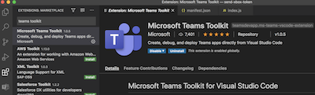

### Developer environment requirements
First thing we need to do is , make sure your development environment is set to success. 

You have

- Installed the Microsoft Teams Toolkit in your Visual Studio Code
- [Node.js](https://nodejs.org/en/) installed (version 6 or higher)
- Set up [ngrok](https://ngrok.com/docs), this is not familiar to you then not to worry , check next section or if you already have this set up ignore the next section.
- [M365 developer account](https://developer.microsoft.com/microsoft-365/dev-program?WT.mc_id=m365-9118-rwilliams)

### Set up ngrok
Why do we need this?
ngrok exposes local servers behind to the public internet over secure tunnels.
In short for a teams app to be tested in the teams client,  it needs to be hosted somewhere and ngrok solves the problem while we are still developing the app and needs to test it locally.
Now that we are convinced why it is used, let's set it up.

Install ngrok 

```
npm install ngrok -g
```

Go to [ngrok]() sign up and get the authtoken
Set the authtoken using command 

```
ngrok authtoken <YOUR_AUTHTOKEN>

```
[More info](https://ngrok.com/docs#getting-started-authtoken)

You can also use the ngork apis fo advanced scenarios in you code, but that's for later. 


### Details steps to develop Messaging Extension

#### Create a new Teams app

Open the extension for Microsoft Teams Toolkit you installed in your VS Code
Click on the link `Create a new Teams app`


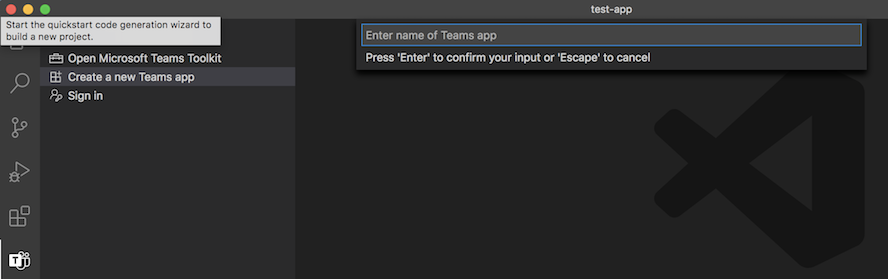

Give it a name of your choice , my app here is named teams-messaging-extension-sendgift

You are still in the Toolkit wizard, the next page is to define what kind of capabilities your project can have.
We can choose `Messaging Extension` and click Next

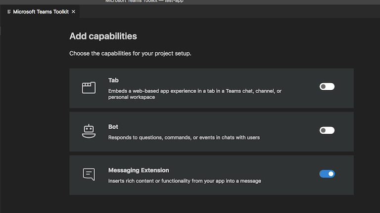

Next you need to add properties to your project.

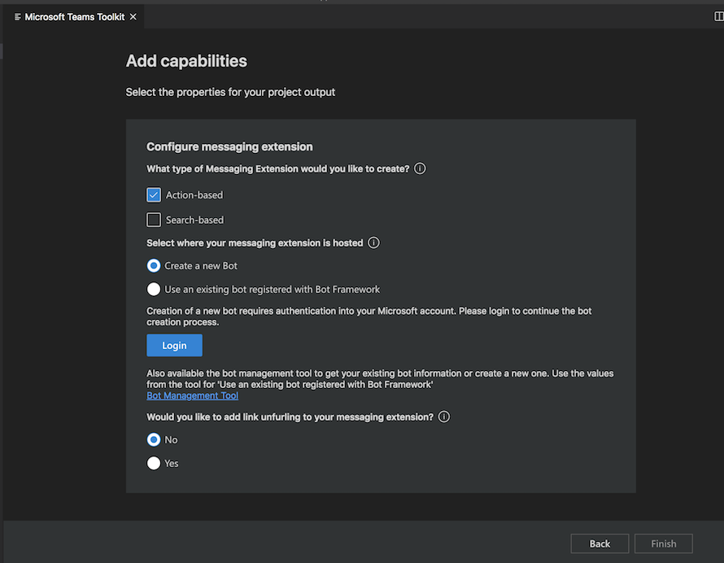

**Type of Messaging Extension**

There are two types of Messaging extensions

- [Action-based](https://docs.microsoft.com/microsoftteams/platform/messaging-extensions/how-to/action-commands/define-action-command?WT.mc_id=m365-9118-rwilliams) commands allow you present your users with a modal popup (called a task module in Teams) to collect or display information, then process their interaction and send information back to Teams
- [Search-based](https://docs.microsoft.com/microsoftteams/platform/messaging-extensions/how-to/search-commands/define-search-command?WT.mc_id=m365-9118-rwilliams) commands allow your users to search external systems and insert the results of that search into a message in the form of a card.

We are creating an action-based one here.

**Select where your messsaging extension is hosted**

As already mentioned before, your extension should be hosted as a webservice somewhere (remember why we needed ngrok) and Teams messaging extensions take advantage of the Bot Framework's messaging schema and secure communication protocol so you have to register a bot inorder to use your webservice as a messaging extension. 
Either click on Login button and sign in using the M365 account you are using, let the toolkit create a new Bot or head to [Azure portal](https://portal.azure.com) to create one manually. See below how to do that.

### Use Toolkit to create a bot

- Login

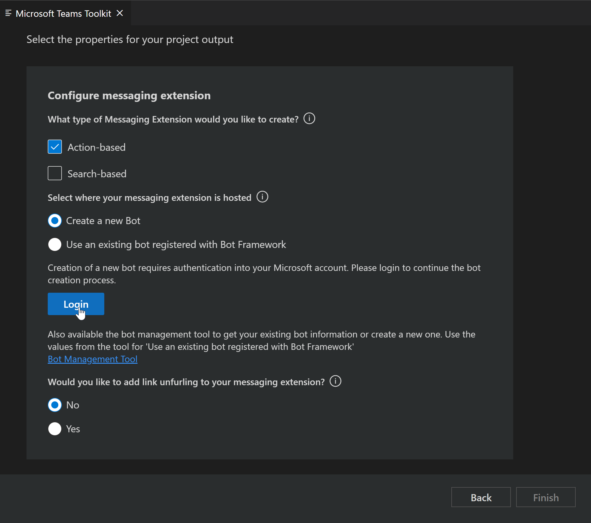

- Give a name 

Make sure you don't add space, although the placeholder suggests space, this can cause error.
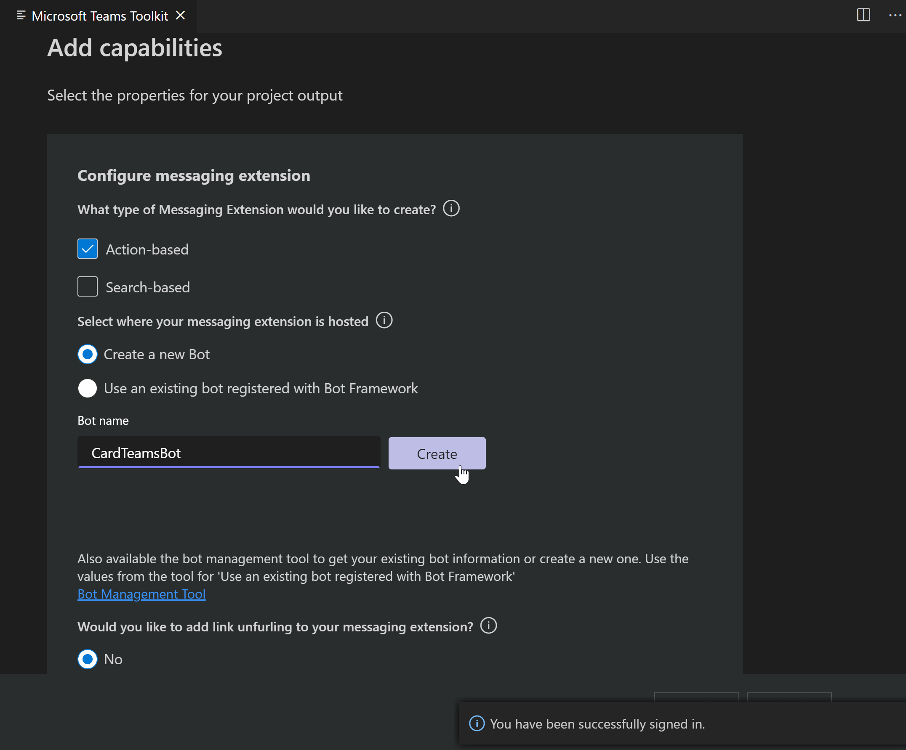

Once done you will get a success message and BotId and Password (make a note of it)

A sample of how that looks like once you create a bot from the Toolkit.
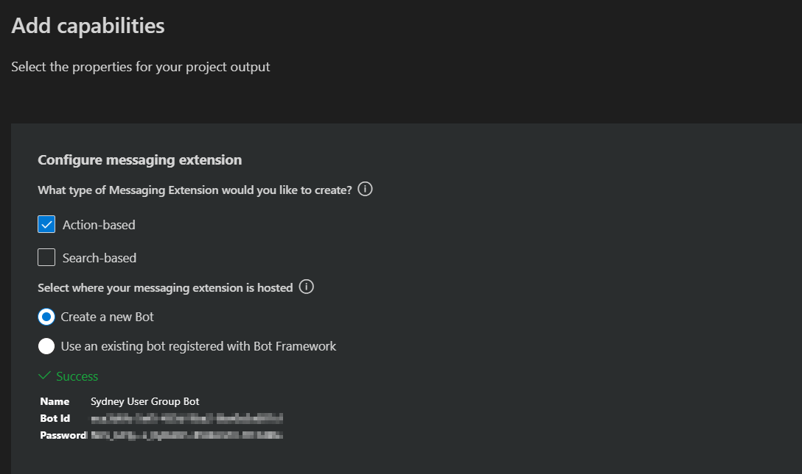


### To create Bot manually through Azure

1) Head to [Azure portal](https://portal.azure.com)

2)  Create a resource (from dashboard)

3) Search for `Bot channel registration` and hit enter


4) Click Create

5)  Fill out the info , the messaging endpoint should look something like `https://myextension.azurewebsites.net/api/messages` where `https://myextension.azurewebsites.net` is my webservice I plan to host my app and create. More info already covered here [Bot channels registration](https://docs.microsoft.com/azure/bot-service/bot-service-quickstart-registration?view=azure-bot-service-4.0&WT.mc_id=m365-9118-rwilliams)
  


6) Once created go to the `Channels` and configure Microsoft Teams channel (just agree on terms after reading them of course)


7) Next we need to go to the bot's settings and manage the appId and secret (it's like id and password for the app)
You can see the appId in below screenshot, now to create a secret, let's click on manage.


Once the secret is created, copy immediately. Now make a note of the appId and the secret, we will need it.

 


> Phew we are almost there !!

Come back to our wizard in VS Code

Choose the second option i.e to use an existing bot and paste the appId and secret we copied earlier and hit finish.
[tip] - Once your project is up and running, you can check this info in the .env file in the project

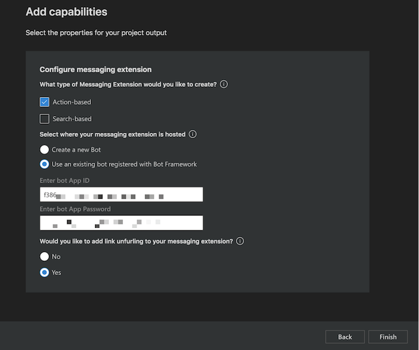

Success, your project is now fully scaffolded and ready to be used.

### Manage Bots

I personally love using the bot emulator to manage the bots that I create.
Please go to [https://dev.botframework.com/bots/](https://dev.botframework.com/bots/) and manage your bots.
What I noticed is that using Teams Toolkit, the Bot is created and already connected to Microsoft Teams channels.

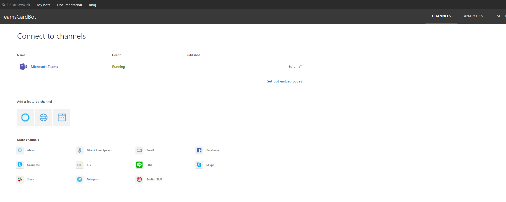

You can also manage bots from within the Toolkit using [bot management tool](https://dev.teams.microsoft.com/appconfiguration.html#/bot/tool)


## Update the manifest incase of an incomplete scaffolding

If everything went well with the process of scaffolding the extension, you may find that the manifest file has value for composeExtension, if not the value will be empty array. In such cases add below code.

Update the composeExtensions with below code to get you started with the extension, with 2 actions

- Create card

- Share message 

They both have events associated that will be triggered when any of the action is performed.

```
 "composeExtensions": [
        {
            "botId": "{botId0}",
            "commands": [
                {
                    "id": "createCard",
                    "type": "action",
                    "context": [
                        "compose"
                    ],
                    "description": "Command to run action to create a Card from Compose Box",
                    "title": "Create Card",
                    "parameters": [
                        {
                            "name": "title",
                            "title": "Card title",
                            "description": "Title for the card",
                            "inputType": "text"
                        },
                        {
                            "name": "subTitle",
                            "title": "Subtitle",
                            "description": "Subtitle for the card",
                            "inputType": "text"
                        },
                        {
                            "name": "text",
                            "title": "Text",
                            "description": "Text for the card",
                            "inputType": "textarea"
                        }
                    ]
                },
                {
                    "id": "shareMessage",
                    "type": "action",
                    "context": [
                        "message"
                    ],
                    "description": "Test command to run action on message context (message sharing)",
                    "title": "Share Message",
                    "parameters": [
                        {
                            "name": "includeImage",
                            "title": "Include Image",
                            "description": "Include image in Hero Card",
                            "inputType": "toggle"
                        }
                    ]
                }
            ]
        }
    ]
```

### Test your app in Teams

Now that we have a project in hand, let us test this app so we can play with it further.

- open the terminal and go to the location of the current project , run one time to install dependencies

```
npm install

```
Then to serve it from local run, 

```
npm start

```

You will see that your local project is now running on localhost:3978 (you can update this port in index.js file). It's still not ready to test.

Now in another terminal session run below tunneling command, which then gives you a https url for your local set up.

```
ngrok http -host-header=rewrite 3978
```

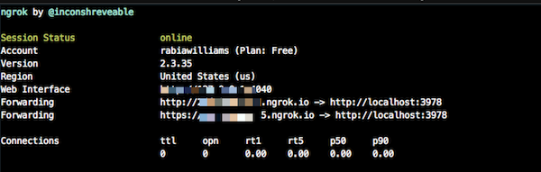

- Find the `development.zip` in the *.publish* folder and upload it to Teams in the Apps icon click `Upload a custom app`

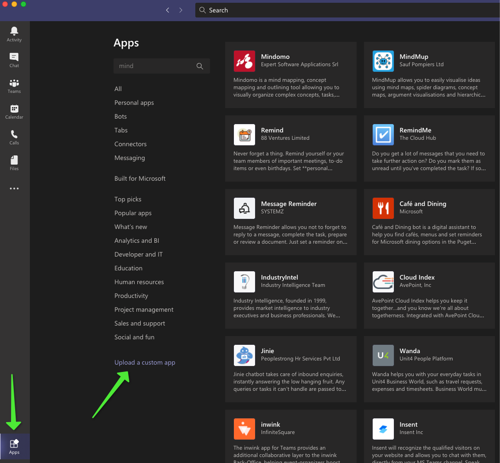

- Click on the Apps icon again and search for AppStudio and open it

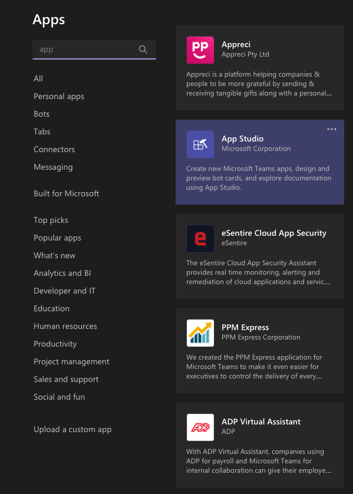

- Go to manifest editor and Edit your app that you just uploaded.

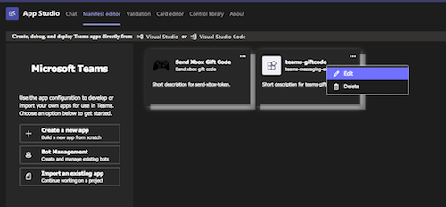

- Copy the ngrok url from the terminal (with https) and paste it before /api/messages in the bot enpoint address. (You can update this in Azure portal as well)

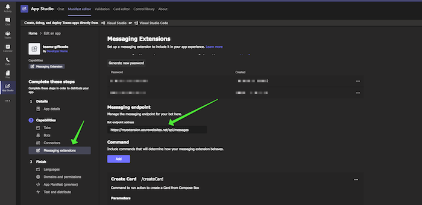

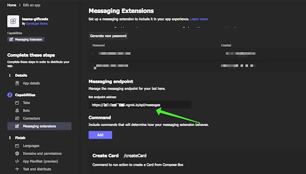

**OR**

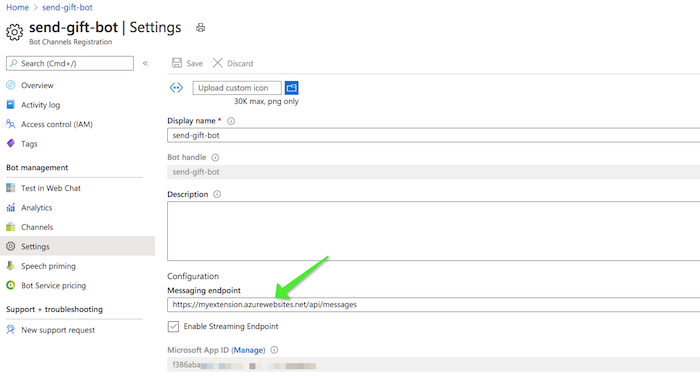


- Now go to a chat window and search for your app/you may already find it.

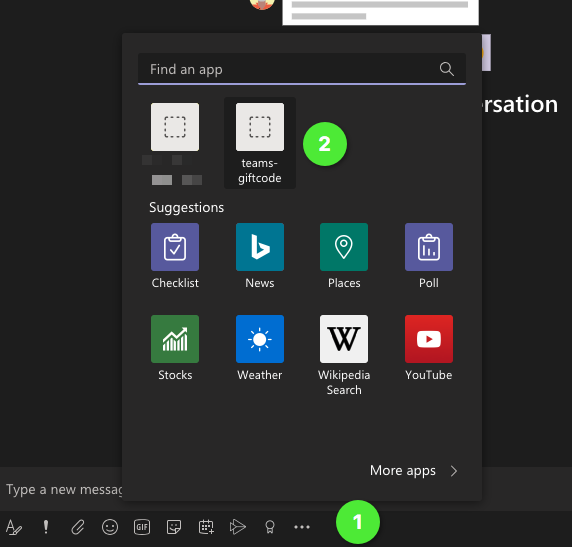

- This is a form sample (action-based) so fill out the form and submit.

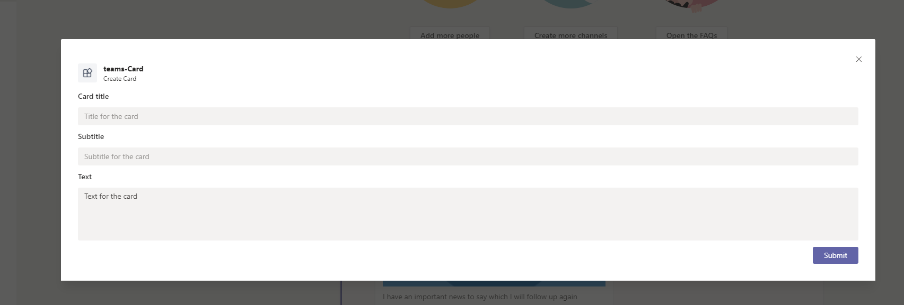

- and you can now see the card in the chat area, hit send and the card is sent to the recipient 

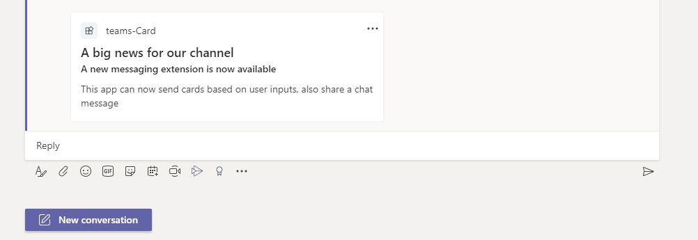

**You have successfully created your first messing extension**

In the next post, we can deep dive into updates to the sample and also how to packaging, deploy to the cloud. Watch this space !


<script async src="https://www.googletagmanager.com/gtag/js?id=UA-146817327-1">
</script>
<script>
  window.dataLayer = window.dataLayer || [];
  function gtag(){dataLayer.push(arguments);}
  gtag('js', new Date());

  gtag('config', 'UA-146817327-1');
</script>
