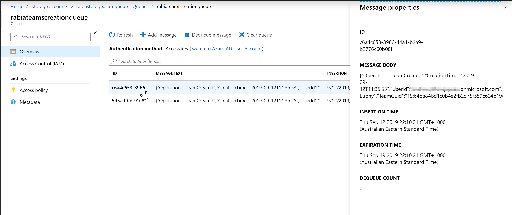

# Using O365 management activity API to track Microsoft Teams creation

> Getting Microsoft Teams Team creation information into Azure Queue storage 

<span style="color:grey">Published on 12/09/2019</span>

I have been looking into **O365 Management Activity API** for a few days now to understand how to best retrieve certain activities from O365.

Audit log search in the portal is great but it has it's problems, the data has to be exported and used.
I was looking into ways we can transfer this data automatically to some place else where it can be retained and used for monitoring, analysis and reporting (Obviously there will be governance applied to where this data is)

I was at the Power Platform Summit in Melbourne this year and was inspired by the presentation from Microsoft MVP [Paul Culmsee](https://twitter.com/paulculmsee?lang=en) on audit logs and it's API. 
With solutions using these apis, companies will able to create solutions to have greater visibilty and control over the activities of their contents.

My solution is a timer based C# application , You can choose it to be a a timer based Azure function , console app running in Azure Function to run exe or a webjob. The idea is for this app to run daily to pull data using O365 management api.

My solution tracks Teams activities (Teams Creation) into a storage which can then become a log 'forever', since,
<div style="background:#E0F2FF;border:1px solid #E0F2FF; border-radius:6px; padding:1rem;" >
- Audit records are retained only for 90 days for **Office365 E3** <br/>
- Audit records are retained only for 90 days for **Office365 E5** however it can eventually be available for a year for E5 users and users with E3 and an Office 365 Advanced Compliance add-on license.
</div>

## Steps to use the api

- Enable unified audit logging for your O365 organization, see instructions on [how to turn O365 audit log on/off](https://docs.microsoft.com/en-us/office365/securitycompliance/turn-audit-log-search-on-or-off/?WT.mc_id=m365-0000-rwilliams)
- Register your application in Azure AD 
- Add **Office 365 Management API** permissions Admin consent for the tenant,
   I have added (ActivityFeed.Read)
- Get access token (within your app)
- Subscribe to a content type (within your app)
- List contents (to get content URLs, within your app)
- Read content from the content URLs, within your app)

### First start a subscription

Before you can use the api to read blob contents you have to subscribe to the specified content type.

Here I am subscribing to `Audit.General` to get `Microsoft Teams events`, there are other content types too like SharePoint, Exchange etc.

See code to start a subscription.

```
       public static async Task<AuthenticationResult> Authenticate(AuthenticationContext ctx, string resourceUri, ClientCredential cred)
        {
            AuthenticationResult res = await ctx.AcquireTokenAsync(resourceUri, cred).ConfigureAwait(false);
            return res;

        }
       
 /* This function creates new subscription for audit logs*/ 
      
        public async Task CreateSubscription(string clientID, string clientSecret, string tenantID)
        {
            ClientCredential cred = new ClientCredential(clientID, clientSecret);
            AuthenticationContext ctx = new AuthenticationContext("https://login.windows.net/" + tenantID);
            string resourceUri = "https://manage.office.com";
            AuthenticationResult res = await Authenticate(ctx, resourceUri, cred);
            HttpWebRequest req = HttpWebRequest.Create("https://manage.office.com/api/v1.0/" + tenantID + "/activity/feed/subscriptions/start?contentType=Audit.General") as HttpWebRequest;
            req.Headers.Add("Authorization", "Bearer " + res.AccessToken);
            req.ContentType = "application/json; utf-8";
            req.Method = "POST";

            using (var streamWriter = req.GetRequestStream())
            {
                streamWriter.Flush();
                streamWriter.Close();
            }
            HttpWebResponse response = (HttpWebResponse)req.GetResponse();
            Stream dataStream = response.GetResponseStream();
            StreamReader reader = new StreamReader(dataStream);
            string responseFromServer = reader.ReadToEnd();
        }
```

> Once subscribed, wait upto 12 hours for it to come into effect for me it did not take 12 hours but I guess it depends.

### List available contents to get content URLs and read the contents

Below you can see how I am listing the content urls (fn ListContent) , then I read the contents (fn ReadContent)which I then add into an azure queue.

While reading the contents, I am filtering them to have only `Microsoft Teams` (Workload) items with `TeamCreated`(operation) action. I am also choosing from the schema what I pass to my queue.
    - Operation 
    - CreationTime 
    - UserId 
    - TeamName 
    - TeamGuid 
    - Workload 

Please note that you can pass `starttime` and `endtime` in the api, but it should not be more than 24 hours apart and starttime not more than 7 days in the past. which is why it is a good idea to make this application a timer based job/ function that runs daily to fetch logs.
Default is last 24 hours.

```
       /* This function reads through the audit logs and get their content uri and performs read function to process the content uri links as audit events
       */ 
        public async Task ListContent(string clientID, string clientSecret, string tenantID)
        {
            DateTime starteDate = new DateTime(2019, 9, 11, 0, 0, 0);
            DateTime endDate = new DateTime(2019, 09, 11, 21, 0, 0, 0);
            string strstartDate = starteDate.ToString("yyyy-MM-ddTHH:mm:ss");
            string strendDate = endDate.ToString("yyyy-MM-ddTHH:mm:ss");
            ClientCredential cred = new ClientCredential(clientID, clientSecret);
            AuthenticationContext ctx = new AuthenticationContext("https://login.windows.net/" + tenantID);
            string resourceUri = "https://manage.office.com";
            AuthenticationResult res = await Authenticate(ctx, resourceUri, cred);
             HttpWebRequest req = HttpWebRequest.Create("https://manage.office.com/api/v1.0/" + tenantID + "/activity/feed/subscriptions/content?contentType=Audit.General&amp;startTime=" + strstartDate + "&amp;endTime=" + strendDate) as HttpWebRequest;
            req.Headers.Add("Authorization", "Bearer " + res.AccessToken);
            req.ContentType = "application/json";
            req.Method = "GET";
            HttpWebResponse response = (HttpWebResponse)req.GetResponse();
            Stream dataStream = response.GetResponseStream();
            StreamReader reader = new StreamReader(dataStream);
            string responseFromServer = reader.ReadToEnd();
            //Getting all notifications as JArray
            JArray notifications = JArray.Parse(responseFromServer.ToString());
            var startTime = DateTime.Now;
            Console.WriteLine("Total Notifications: " + notifications.Count + " === Start Time: " + startTime);
            foreach (var notification in notifications)
            {
                await ReadContent(clientID, clientSecret, tenantID, notification["contentUri"].ToString());

            }
            var endTime = DateTime.Now;
            Console.WriteLine(" === End Time: " + DateTime.Now);
            Console.ReadKey();
        }
       
        public async Task ReadContent(string clientID, string clientSecret, string tenantID, string contenturi)
        {

            ClientCredential cred = new ClientCredential(clientID, clientSecret);
            AuthenticationContext ctx = new AuthenticationContext("https://login.windows.net/" + tenantID);
            string resourceUri = "https://manage.office.com";
            AuthenticationResult res = await Authenticate(ctx, resourceUri, cred);
            //Read the Events from the contentUri
            HttpWebRequest req = HttpWebRequest.Create(contenturi) as HttpWebRequest;
            req.Headers.Add("Authorization", "Bearer " + res.AccessToken);
            req.ContentType = "application/json";
            req.Method = "GET";
            HttpWebResponse response = (HttpWebResponse)req.GetResponse();
            Stream dataStream = response.GetResponseStream();
            StreamReader reader = new StreamReader(dataStream);
            string responseFromServer = reader.ReadToEnd();
            JArray auditLogEvents = JArray.Parse(responseFromServer.ToString());
            List<Message> auditedItems = (auditLogEvents).Select(x => new Message
            {
                Operation = (string)x["Operation"],
                CreationTime = (DateTime)x["CreationTime"],
                UserId = (string)x["UserId"],
                TeamName = (string)x["TeamName"],
                TeamGuid = (string)x["TeamGuid"],
                Workload = (string)x["Workload"]
            }).Where(y => y.Workload == "MicrosoftTeams" && y.Operation == "TeamCreated").ToList();

            Console.WriteLine("Total Audit Log Events For Teams Creation: " + auditedItems.Count);
            foreach (var auditedItem in auditedItems)
            {
                //Store in azure queue
                CloudStorageAccount storageAccount = CloudStorageAccount.Parse(connectionString);
                CloudQueueClient queueClient = storageAccount.CreateCloudQueueClient();
                CloudQueue queue = queueClient.GetQueueReference("rabiateamscreationqueue");
                var asyncQueue = AzureQueue.SendMessageAsync(queue, JsonConvert.SerializeObject(auditedItem));
                asyncQueue.Wait();

            }
        }
```

### Azure queue as storage

At the moment I have chosen `Azure Queue` as my storage option, since it is easy to set up and I can trigger events from it (future blog?)

Here is my queue after I run the application.



I can also use Flow to get Azure Queue messages into a SharePoint list since there are Azure Queue connectors to retrieve messages it will be pretty easy to set it up.

I have seen the option to create webhooks as well which is a push but seems like the risks are high due to difficulty in debugging and trouble shooting.
It requires you to host a webapi to respond to the push.
It is also de-emphazied  by Microsoft due to several issues.
A pull is always a better and consistent approach to go than a push especially for production ready applications.

Hope there was some take away from this humongous post, happy coding :)

##Kudos

My research would not have been complete without these awesome references

- [Office 365 Management Activity API ](https://docs.microsoft.com/en-us/office/office-365-management-api/office-365-management-activity-api-reference/?WT.mc_id=m365-0000-rwilliams)
- [Retrieve audit logs programmatically by Ashish Padhy](https://asishpadhy.com/2019/01/16/retrieve-office-365-audit-logs-programmatically-using-office-management-api-and-azure-functions/)


<!-- Global site tag (gtag.js) - Google Analytics -->
<script async src="https://www.googletagmanager.com/gtag/js?id=UA-146817327-1">
</script>
<script>
  window.dataLayer = window.dataLayer || [];
  function gtag(){dataLayer.push(arguments);}
  gtag('js', new Date());

  gtag('config', 'UA-146817327-1');
</script>


