# How to build your own search based GIPHY app with Microsoft Teams Toolkit

Create a search based `Messaging extensions` in Microsoft Teams.

<span style="color:grey">Published on 30/10/2020</span>

Hoping this article will get you started in creating more search based messaging extensions which will query an external system via an API call and with the information response,  we create cards that can be inserted into chat.

Here we will recreate the GIPHY app ourselves 😊!! Hope you will have fun by building this app.

Sample available in **Microsoft Teams Development Samples** [https://aka.ms/teams-samples](https://aka.ms/teams-samples)

[Go to source app](https://github.com/pnp/teams-dev-samples/tree/master/samples/msgext-search-giphy)


## What this blog covers

- [Microsoft Teams Toolkit](https://marketplace.visualstudio.com/items?itemName=TeamsDevApp.ms-teams-vscode-extension&WT.mc_id=m365-9320-rwilliams)
- Detailed steps to [Create a Microsoft Teams search based messaging extension](https://docs.microsoft.com/microsoftteams/platform/messaging-extensions/how-to/create-messaging-extension?WT.mc_id=m365-9320-rwilliams) using the toolkit
- [Sample source code](https://github.com/pnp/teams-dev-samples/tree/master/samples/msgext-search-giphy)
- A fun GIF search app which you can create and use.

First thing we need to do is , make sure your development environment is set to success. 

You have

- Installed the Microsoft Teams Toolkit in your Visual Studio Code
- [Node.js](https://nodejs.org/en/) installed (version 6 or higher)
- Set up [ngrok](https://ngrok.com/docs), this is not familiar to you then not to worry , check next section or if you already have this set up ignore the next section.
- [M365 developer account](https://developer.microsoft.com/microsoft-365/dev-program?WT.mc_id=9320-9118-rwilliams)

For ngrok set up etc go to my [previous blog](https://rabiawilliams.com/teams/message-extensions/) so I don't have to repeat 😊
But there have been a lot of changes in terms of UI from within the Teams Toolkit so stay here after your initial set up.

**Type of Messaging Extension**

There are two types of Messaging extensions

- [Action-based](https://docs.microsoft.com/microsoftteams/platform/messaging-extensions/how-to/action-commands/define-action-command?WT.mc_id=m365-9118-rwilliams) commands allow you present your users with a modal popup (called a task module in Teams) to collect or display information, then process their interaction and send information back to Teams
- [Search-based](https://docs.microsoft.com/microsoftteams/platform/messaging-extensions/how-to/search-commands/define-search-command?WT.mc_id=m365-9118-rwilliams) commands allow your users to search external systems and insert the results of that search into a message in the form of a card.

Here you will build Search based one, if you want to build an action based one, check out my blog [here](https://rabiawilliams.com/teams/message-extensions/)

### Create the app

Once you have installed the extension for [Microsoft Teams Toolkit](https://docs.microsoft.com/microsoftteams/platform/messaging-extensions/how-to/create-messaging-extension?WT.mc_id=m365-9320-rwilliams), go ahead and create an app.

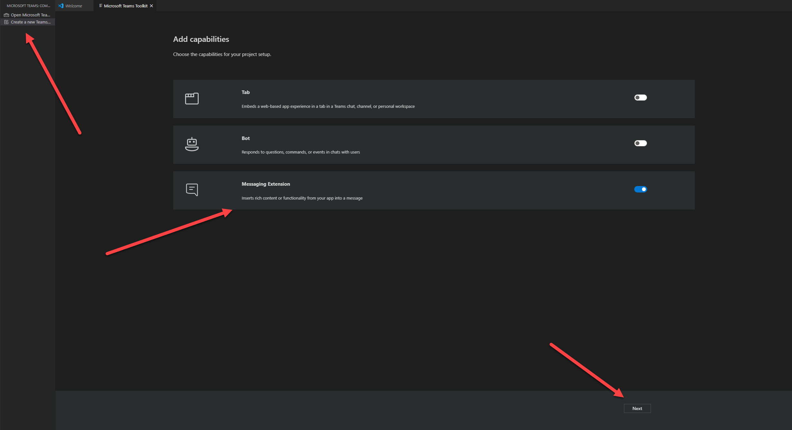


Once an app is created, it will be already availabe in the [App Studio](https://docs.microsoft.com/en-us/microsoftteams/platform/concepts/build-and-test/app-studio-overview/?WT.mc_id=m365-9320-rwilliams) (this is the app registration). 

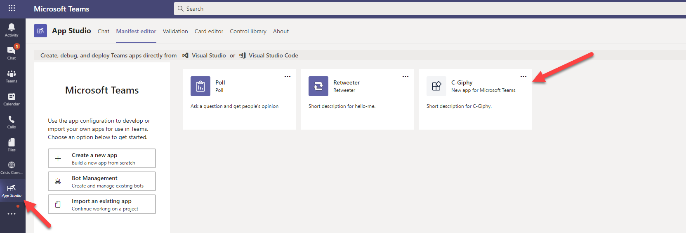


> Do not delete these apps from App Studio or you cannot update the app using Teams Toolkit. It will throw an error when you try to update the `App Details`


### Give it a name

You are now walking through the wizard. Give the app a name

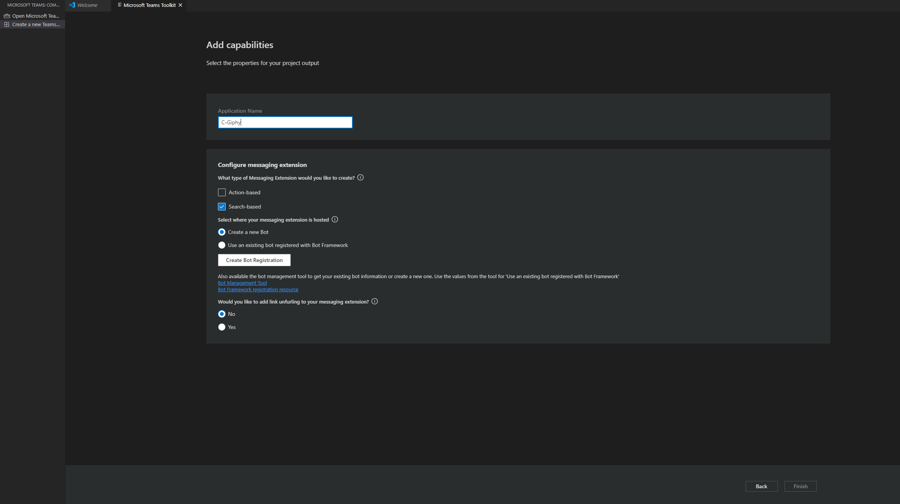


### Create the bot

From the toolkit, create a new BOT or use an existing one. You will have to login to your tenant to do this.

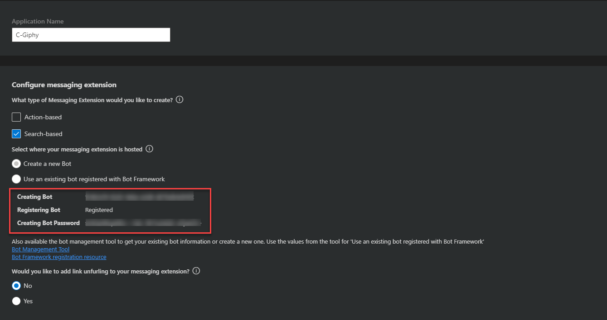


More on bots [here](https://rabiawilliams.com/teams/message-extensions/#use-toolkit-to-create-a-bot) 


Click on **Finish**


### Project scaffolding

Choose a workspace where you want your project to be scaffolded (local) and click **Choose workspace** and your project will be created as shown below.


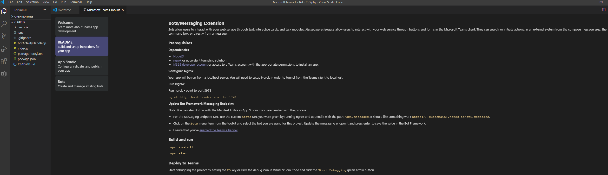


### Ngrok Url + Bot messaging end point

In a terminal session run below tunneling command, which then gives you a https url for your local set up.

```
ngrok http -host-header=rewrite 3978
```

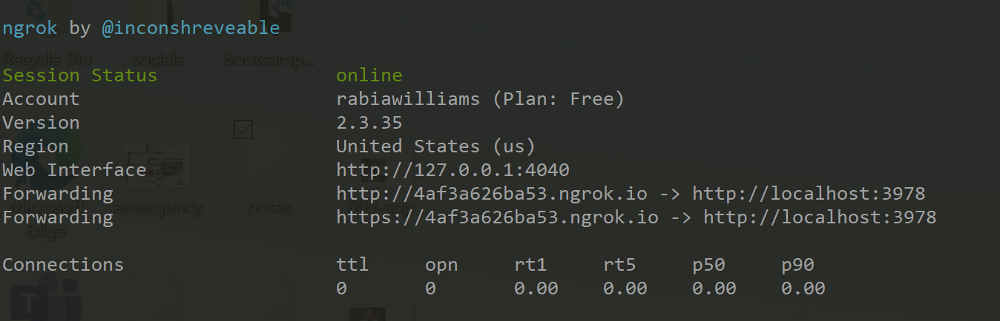

Copy this URL.

Now within Visual Studio Code , go to the Toolkit > Bots , you will have to sign in again here.


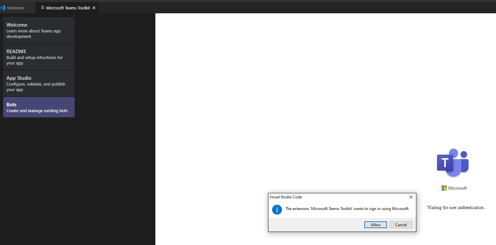

Choose the Bot you just created


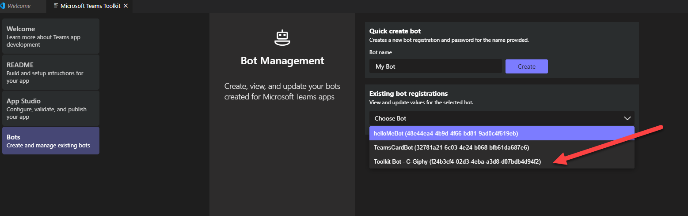


And update the messaging end point which is your ngrok url + `/api/messages`

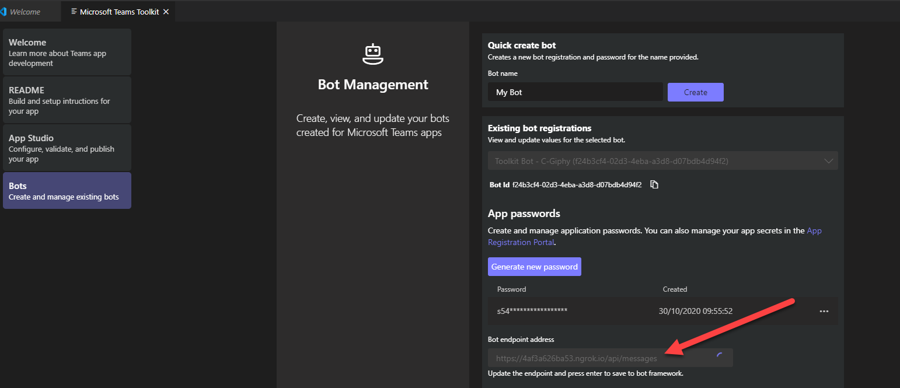


### App Updates

Update your app details from within the toolkit, you might notice there is no manifest file to update manually. Everything is done in the cloud and synced in real time.

E.g let us update the Icons from the Toolkit


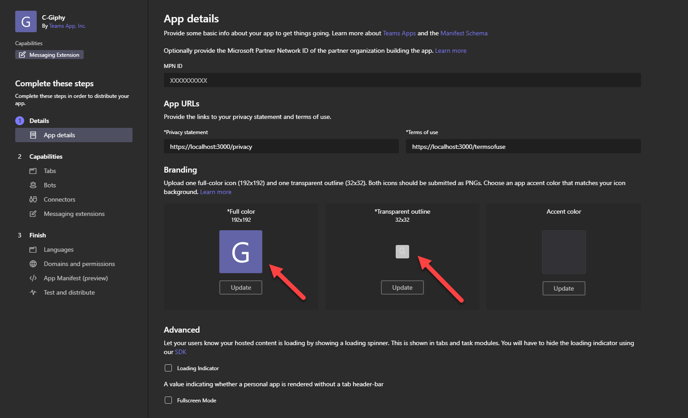


If you go to App Studio you will notice it already updated (like magic)


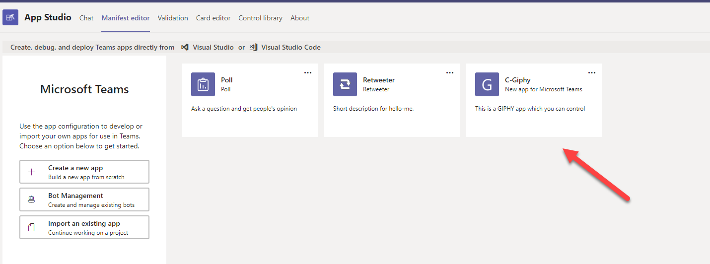


### Code changes

Now let us set up our project to run locally to test.


open the terminal and go to the location of the current project , run one time to install dependencies

```
npm install

```

update the code from my sample, the files changed will be


- botActivityHandler.js
- env 


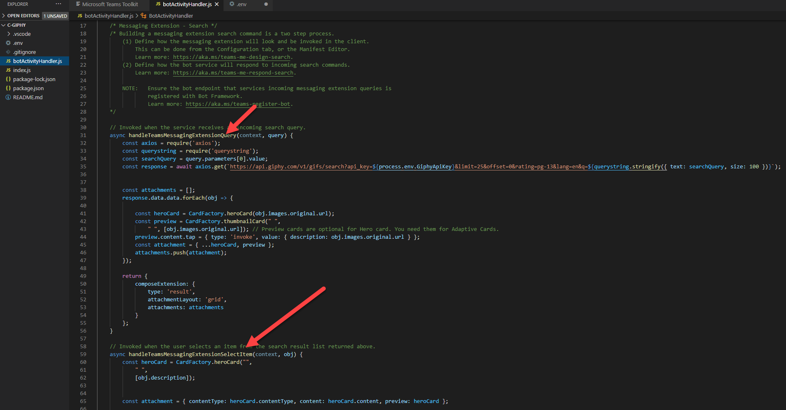


In botActivityHandler.js I am updating the `handleTeamsMessagingExtensionQuery` which is the function that is invoked when the service receives an incoming search query.

I am calling the GIPHY API, I have a key which I am storing in `env` file. Get your free key from [GIPHY Developers](https://developers.giphy.com/)
And returning the results in a grid.

And `handleTeamsMessagingExtensionSelectItem` which is the function that is invoked when the user selects an item from the search result grid returned from the search experience.

Your env file will already have the BOT ID and BOT Password which was done as part of the scaffolding step.


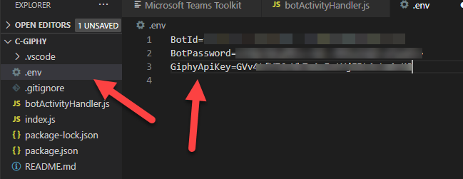


Then to serve it from local run, 

```
npm start

```

You will see that your local project is now running on localhost:3978

You have successfully configured your app, now we need to test it.


### Test your app


From the toolkit, Go to App Studio > Finish > Test and distribute.


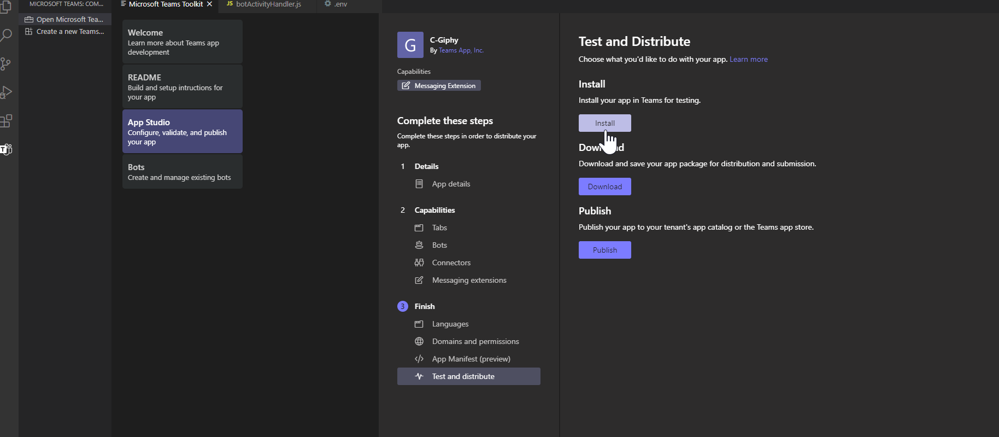

And click on install which will then open the app up in you Teams for you to add

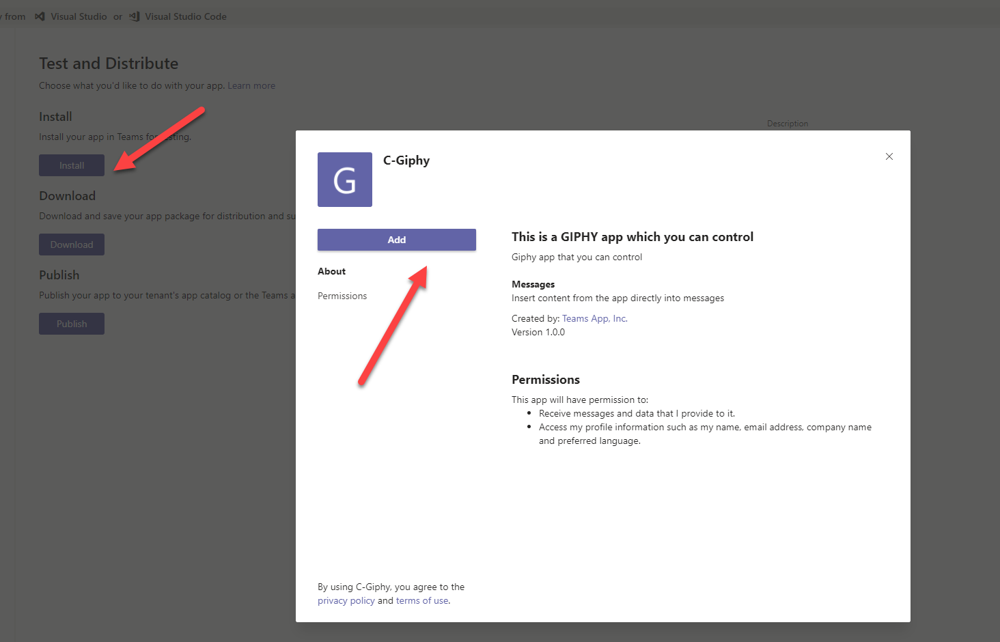

Now go ahead and test it.

- Find the app from the compose area 

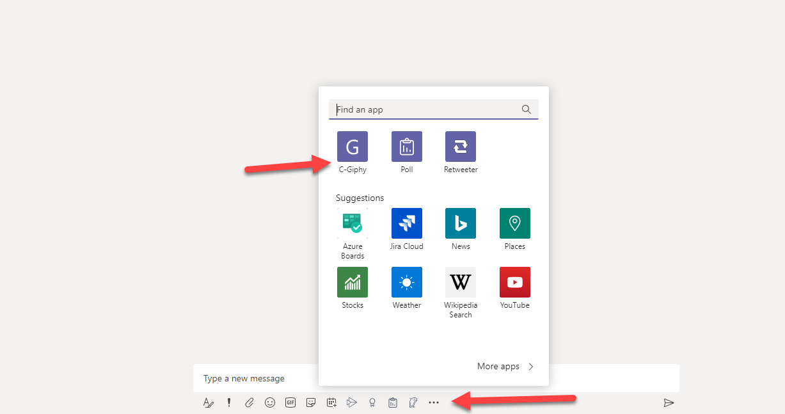

- Search and choose a GIF

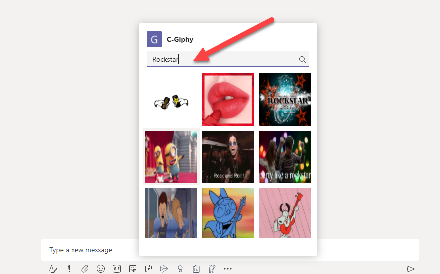

- Add additional message 


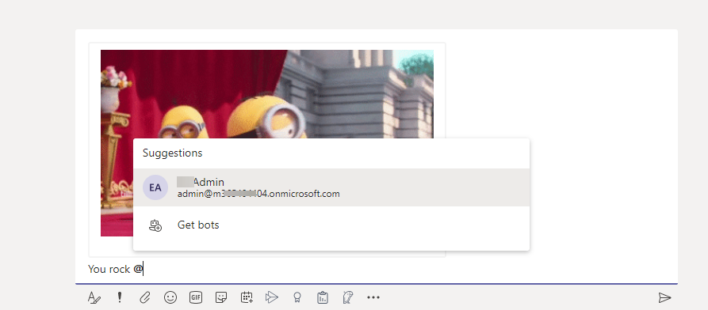

- Send


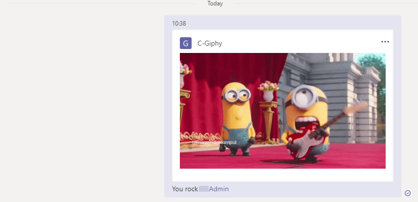


### Package your app


Within the toolkit, you can download the package for install in Teams once you are happy with the implementation.


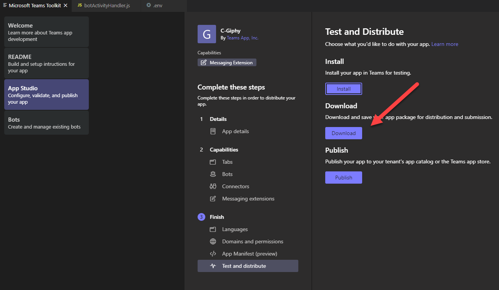


## Points to note 

- Teams Toolkit manages manifest updates, it updates changes real time.
- On creation of App using Toolkit, app is registered in App Studio
- There will be two to three times you need to login, to create app, to add or update BOT
- Learn more about Teams app development [https://aka.ms/teams-doco](https://aka.ms/teams-doco)


### Working App after installation

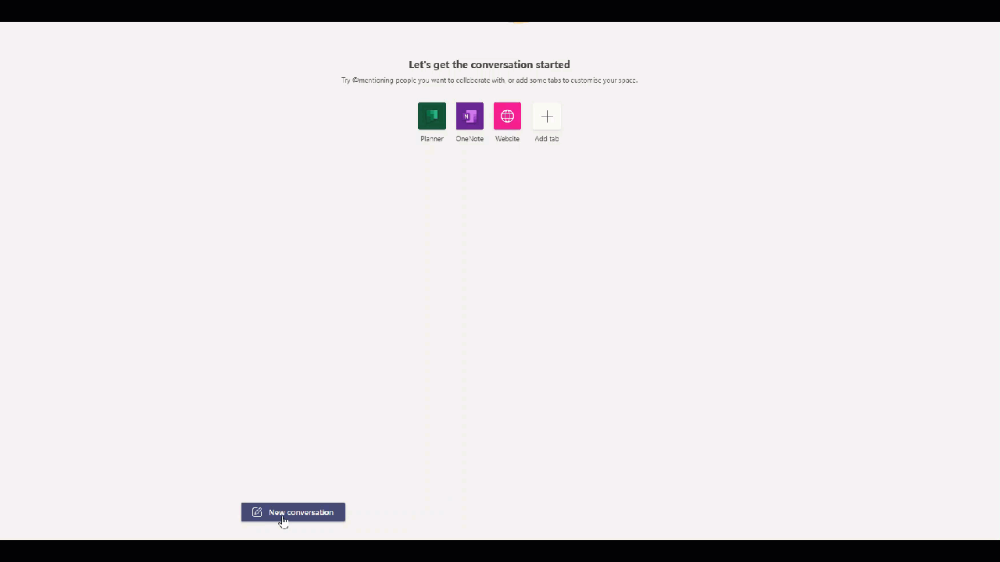


<script async src="https://www.googletagmanager.com/gtag/js?id=UA-146817327-1">
</script>
<script>
  window.dataLayer = window.dataLayer || [];
  function gtag(){dataLayer.push(arguments);}
  gtag('js', new Date());

  gtag('config', 'UA-146817327-1');
</script>


