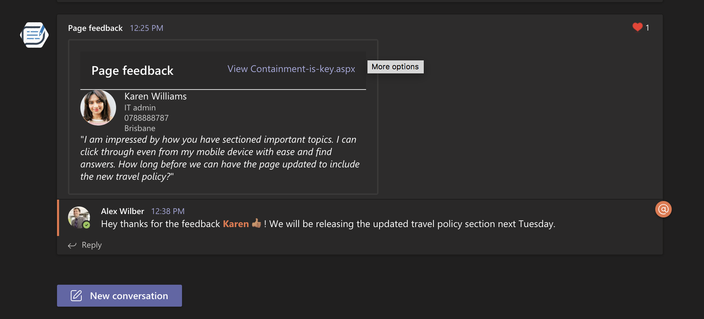
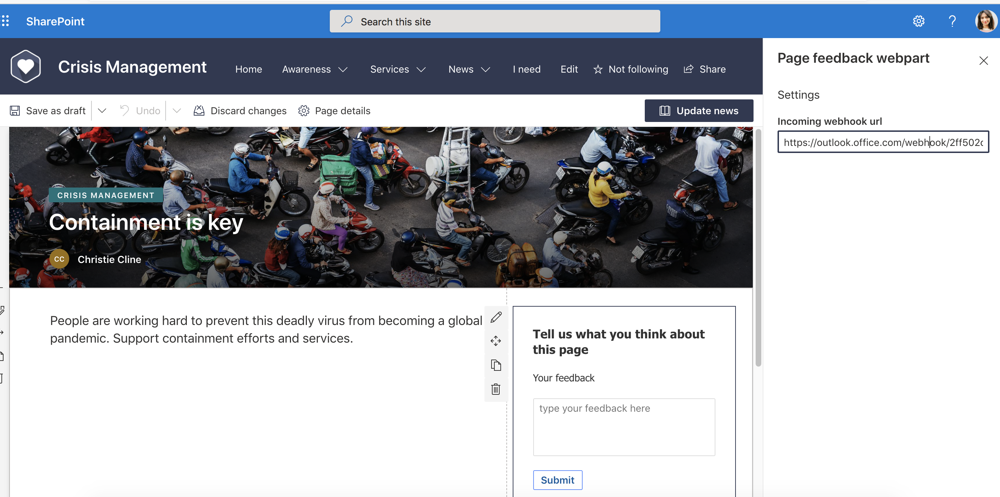
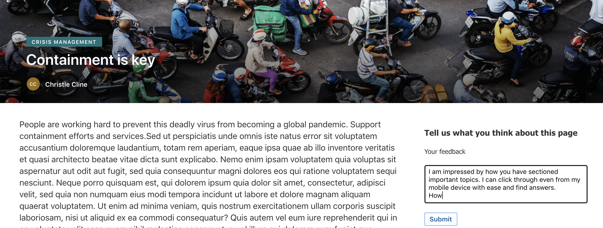
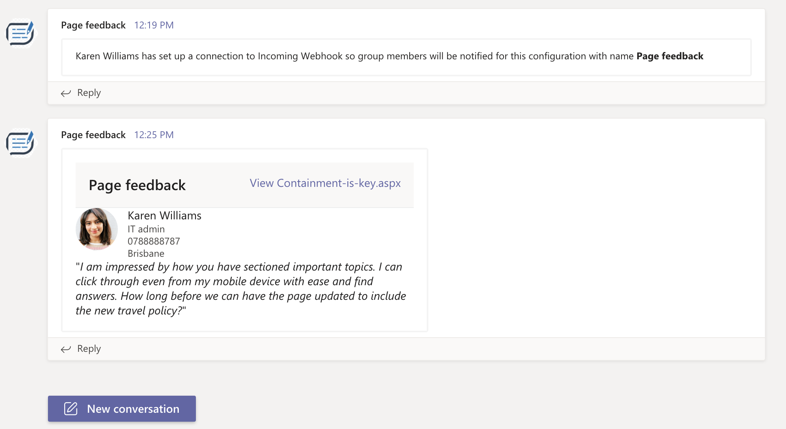
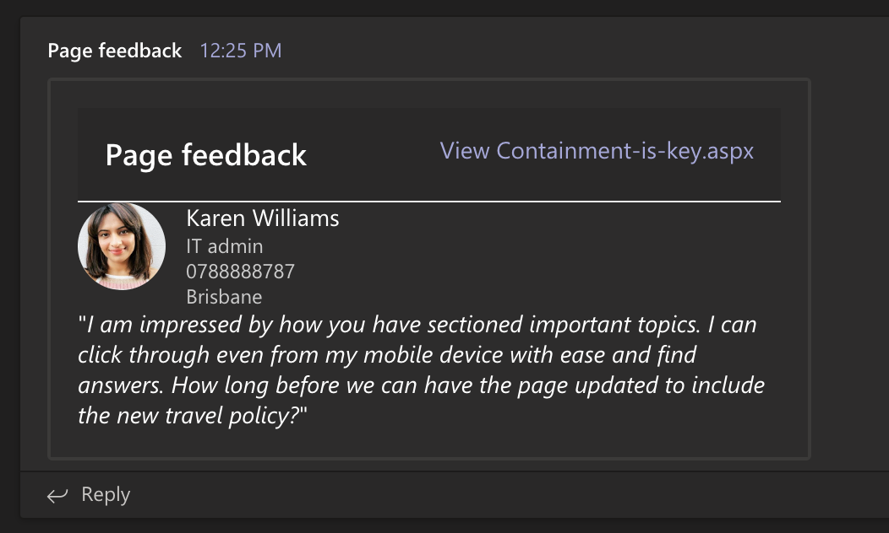

# Use Incoming Webhooks in SPFx app to send page feedback to Microsoft Teams channel.
Published on 13/12/2020

Leverage incoming webhooks to send updates to Microsoft Teams with simple easy integration with an app.

If you have been reading my blog posts you know by now I am obsessed with `Microsoft Teams`.

I stumbled upon [Incoming Webhooks](https://docs.microsoft.com/en-us/microsoftteams/platform/webhooks-and-connectors/how-to/add-incoming-webhook?WT.mc_id=m365-11878-rwilliams), a built-in connector to send updates back to a channel in Teams once configured.

The good thing is, it is easy to set up and even more easy to design your messages you want to send through it.
If you feel like you are not a pro-dev but can play with [Adaptive cards](https://adaptivecards.io) then keep reading. If you are in IT and loves to script things up then you will like this too.

## Incoming webhooks

The documentation around these are easy enough for anyone to understand what they are but here is the blurb. 

> Incoming webhooks are special type of Connector in Teams that provide a simple way for an external app to share content in team channels and are often used as tracking and notification tools. Teams provides a unique URL to which you send a JSON payload with the message that you want to POST, typically in a card format. Cards are user-interface (UI) containers that contain content and actions related to a single topic and are a way to present message data in a consistent way.

[Read full doco here](https://docs.microsoft.com/en-us/microsoftteams/platform/webhooks-and-connectors/how-to/add-incoming-webhook?WT.mc_id=m365-11878-rwilliams). 

Being just a POST operation with a JSON payload, you can use it in may be your `PowerAutomate` actions or `PowerShell` or `cURL` scripts ( [see how you can do the scripts here](https://docs.microsoft.com/en-us/microsoftteams/platform/webhooks-and-connectors/how-to/connectors-using?WT.mc_id=m365-11878-rwilliams) ) or any web `app` that can invoke a POST operation. Sound a little too easy right? 

It is, which is why treating your webhook URL as a secret might be a good thing, same way as you would treat your PowerAutomate `When an HTTP request is received` trigger. There are heaps of articles by the community on securing the url.

## SPFx + Incoming Webhooks

Now for my `SPFx` enthusiasts, I have made a small sample webpart which uses a small feedback form (nothing fancy) using `Adaptive cards` which captures user feedback, if they choose to submit and sends the feedback to the channel where content authors can see. I am using `Incoming webhooks` to send this notification. 

The message sent is also an adaptive card. They are great when you want to attract some attention to your conversation than plain text.

The reason I chose an adaptive card over just creating a react form in the SPFx webpart was because I was lazy 🙃 and these cards are a quick win.

Sending the feedback to a channel where it can be tracked and responded to sounds more reasonable than sending emails that would clutter in the inbox of the content author, isn't it? This way the entire team has visibility as well, you could chat further there with the authors. It's all about collaboration and reducing the noise in multiple applications. 

Check this out how it works out and you can build this EASILY!

## The feedback webpart.

At first I configured the incoming webhooks, see here how to [configure it to a Teams channel](https://docs.microsoft.com/en-us/microsoftteams/platform/webhooks-and-connectors/how-to/add-incoming-webhook#add-an-incoming-webhook-to-a-teams-channel/?WT.mc_id=m365-11878-rwilliams).

Then now that I have my URL, I can simply paste it into my webpart's settings. Just reminding you again this is for demo purpose, you should treat this URL as a secret.

The configuration is done and we can test the feedback form.

Now let's go ahead and give a feeback!

Here is the feeback form, and a user is giving a feedback for a page she found useful.

And in the feedback channel (may be a channel for content authors), they can see the feedback posted into the channel where we configured the webhook.

It's not just a one liner text but a card. The user information in right here in the card, the feedback is shown, 
and the link to the page that the user gave feedback on is deeplinked. 

Everything the content author needs to take action is right here in the chat 💪🏾

The use of adaptive cards have really made the UI aspect pretty theme friendly as you can see the dark mode is already working with the same card. That is the beauty of Adaptive cards, build once, use in multiple apps retaining the native app's look and feel.

I am also using [Microsoft Graph](https://docs.microsoft.com/en-us/graph/api/user-get?view=graph-rest-1.0&tabs=http/?WT.mc_id=m365-11878-rwilliams) to pull out the user information to show more info of the user who sends the feedback.
Here we are showing the job title, contact number and location using the sdk. This will make sure the content authors know who gave a feedback, what their role is etc. 

Here is the [source code](https://github.com/rabwill/react-feedback-incoming-webhook) for the above SPFx webpart.

If you find `Incoming Webhooks` useful and is planning to use to send updates and notifications from your application, be it any application, then you should also join us on 16 Dec for the [Learn Together](https://aka.ms/learntogether) event 🎉

##  Learn more about building apps for Teams.

There are so many more capabilities for you to explore and learn, so if you have not registered for the `Learn Together` event I would suggest you do.

I will be hosting a session with the versatile [Bob German](https://twitter.com/Bob1German) exploring different ways you can integrate your app to Teams.

Thanks for reading, I hope you have a great holiday 🎄

