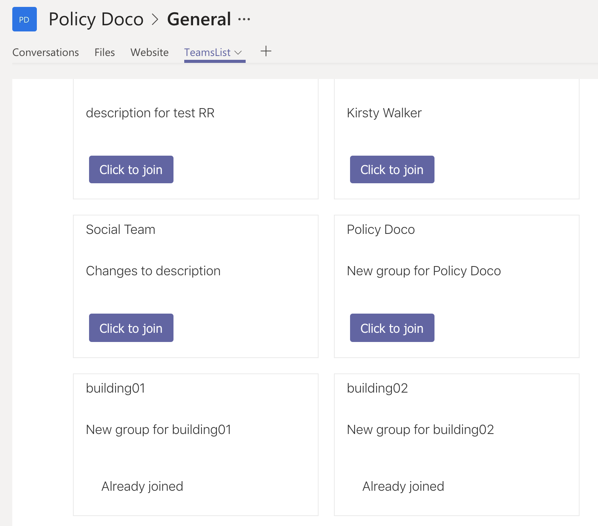
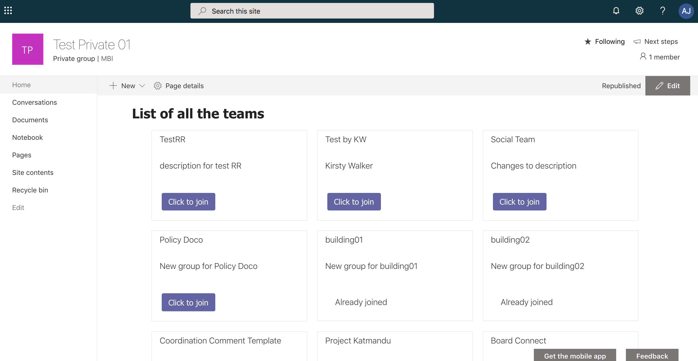

#TEAMS DIRECTORY using SPFx & MS Graph

An SPFx take on a list of teams, which can be used as a Teams app.

Published on 6/5/2019

The other day I came across an interesting post on teams directory and deeplinking see original post [here](https://www.petri.com/creating-publishing-teams-directory) and a tweet discussing different approaches for the same or similar use cases was posted- [Tweet link](https://twitter.com/12Knocksinna/status/1123203680394727426).

I knew this was something I can do as a webpart using `SPFx` and `MS Graph` which is a completely different approach from the scripting approach in the post. They both serve the same solution to a common requirement and it was fun to have a developer's take on the requirement.

I took the liberty of the long weekend here in Queensland and started off with the webpart for demonstrating the approach.

The `SPFX webpart` which can also be a `Teams Tab`, will list out all the teams in a tenant.
It will also hint the user if he is already part of the Team or not.
If he is not a part of the Team, then he will get a link to join the team.

### In Teams

### In SharePoint

This webpart can be used in SharePoint sites as well as uploaded as an app in Teams via [side loading](https://docs.microsoft.com/en-gb/microsoftteams/platform/concepts/apps/apps-upload/?WT.mc_id=m365-0000-rwilliams)

See complete code here [https://github.com/rabwill/teams-list](https://github.com/rabwill/teams-list)

Feel free to use and share it #sharingiscaring

<!-- Global site tag (gtag.js) - Google Analytics -->

