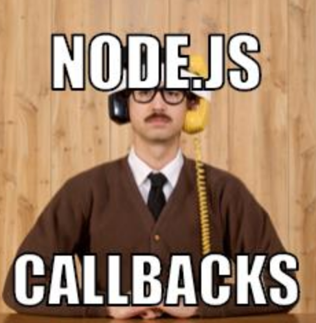
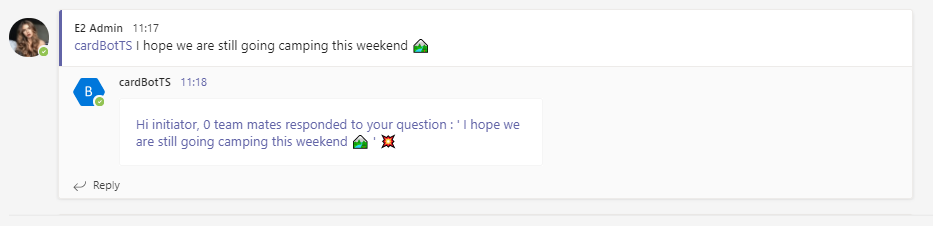
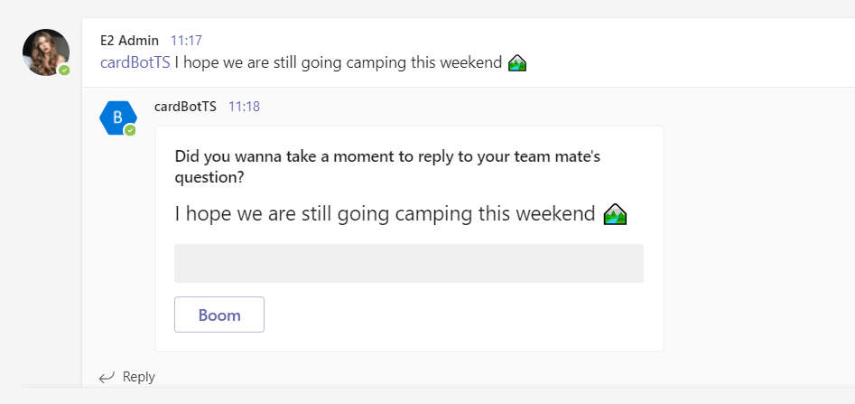
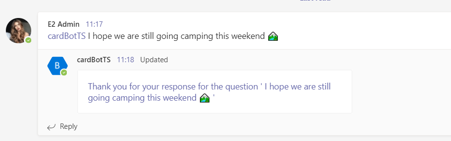
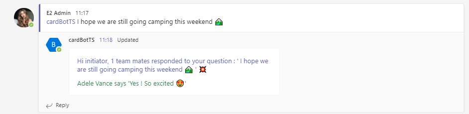
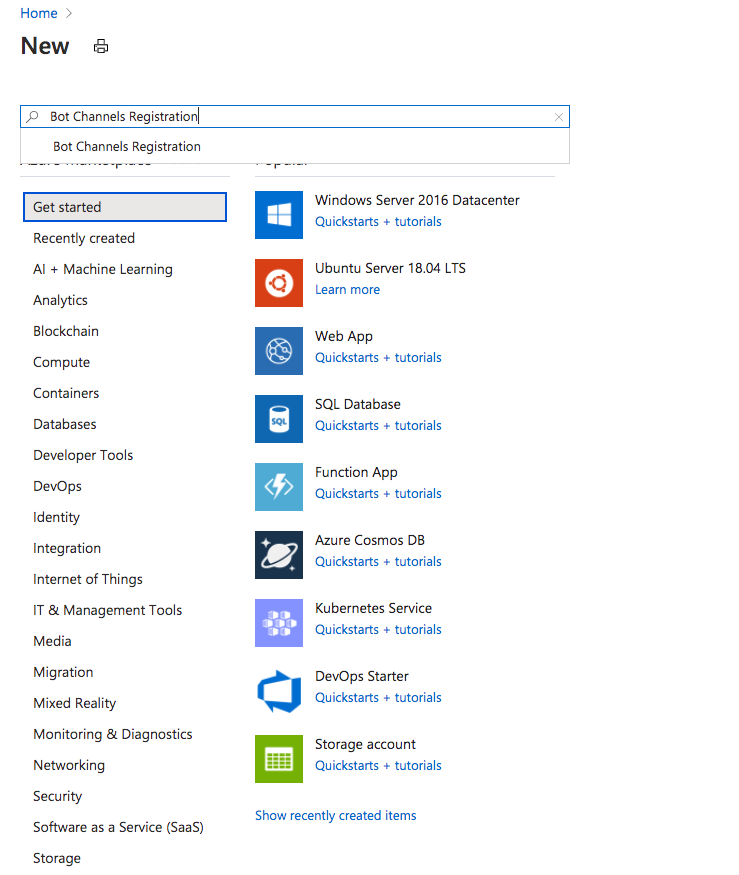
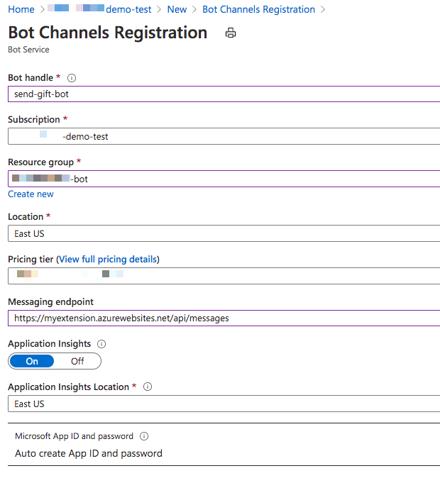
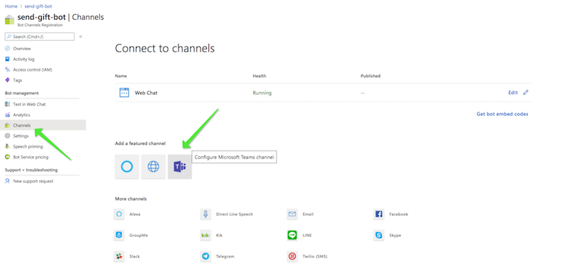
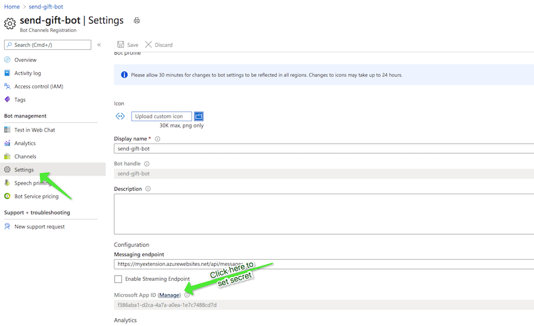
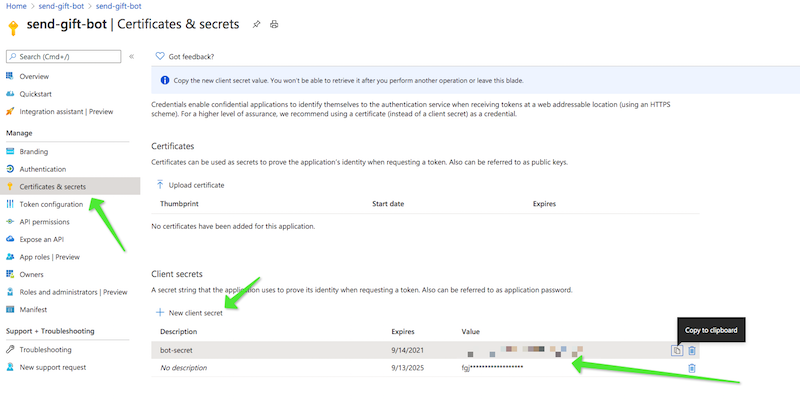

# Universal Actions for Adaptive Cards in a NodeJs project

<span style="color:grey">Published on 16/07/2021</span>

Earlier this year I had the biggest opportunity ever to speak at the [2021 Microsoft BUILD event](https://mybuild.microsoft.com/sessions/337ee14e-a234-4c63-95dd-117dbe05d1bc?source=sessions) about Adaptive cards capabilities with the new [Universal Actions](https://aka.ms/universal-actions-model) 😇

The sample C# project you see in the BUILD event demo, developed by the engineering team @ Microsoft is yet to be published in this [repo](https://github.com/microsoft/BotBuilder-Samples) but you can find another sample, the [catering bot](https://github.com/OfficeDev/Microsoft-Teams-Samples/tree/main/samples/bot-teams-catering/csharp) which uses UAM.

We also have an amazing community here for Microsoft 365 and you can also checkout these samples in C# by some Microsoft MVPs in our community.

- [Incident Management](https://nanddeepnachanblogs.com/posts/2021-07-05-universal-actions-adaptive-cards-teams/) by Nanddeep Nachan

- [Universal Actions](https://www.vrdmn.com/2021/07/working-with-adaptive-card-universal.html) by Vardhaman Deshpande


If you are looking for a simple Nodejs sample, stay here 😉



## Scenario

- I can use the BOT to put a question or a thought in the channel/group chat conversation.
- My team mates can respond to the question with a form to put free text in.
- I can check how many team mates responded in the same card with their responses, real time. I don't need to force any refresh.


This scenario covers below capabilities:

### User Specific Views

Same card, in the same conversation with different views based on whether you:

- Initiated the bot with a question
- Responded to the question in a form
- Have not responded to the question

This is what they call `User Specific View`.

### Up to date cards

Same card refreshed and kept up to date to show initiator no of responses and the actual responses dynamically fed into the card, in the SAME CARD in the SAME CONVERSATION!!! This uses refresh and message edits for keeping the card `Up to date`

### Sequential Workflow support

And all this time, every user has their own workflow to deal with no matter how many other people responded to the same card, and this is what they call `Sequential Workflows`.

You can read all about these in [https://aka.ms/universal-actions-model](https://aka.ms/universal-actions-model)

So here are the steps I did to get from A to B.

## Create a sample bot first

To demonstrate the capabilities I decided to build a bot for Microsoft Teams. Now to start off with a bot I first thought of using the official Visual Studio Code extension - [Teams Toolkit](https://marketplace.visualstudio.com/items?itemName=TeamsDevApp.ms-teams-vscode-extension&WT.mc_id=m365-35338-rwilliams) or the [Yeoman generator](https://github.com/pnp/generator-teams) for Teams developed by the community.

As I was fiddling with them I noticed that the default project scaffolded out, had a lot going on which is great for a seasoned developer but not so much for a newbie. I checked with my colleague and good friend [Bob German](https://twitter.com/Bob1German) around options since he is also my Bot guru and have regularly checked my progress and even reviewed this project, he suggested [generator-botbuilder](https://www.npmjs.com/package/generator-botbuilder) which is a Yeoman generator for Bot Framework v4.
It was perfect for me, I chose a simple Echo Bot template and scaffolded out the project. 

I updated the bot packages to latest bot-builder version which has the universal actions capabilities, I also added adaptive card templating package to my project additionally.

## Prep your BOT for storing conversation data
In the project there is the `index.ts` file where I will add code for creating objects of conversation data storage. I need this to save data like, who initiated, who responded, the response texts etc.

> I am going to use  the state and storage features of the Bot Framework SDK, as this is a sample dem. You may use any storage of your choice really.
You can read about saving conversation data in a bot [here](https://docs.microsoft.com/en-us/azure/bot-service/bot-builder-howto-v4-state?view=azure-bot-service-4.0&tabs=javascript&WT.mc_id=m365-35338-rwilliams)

I add below code in `index.ts`, which creates the objects

```typescript
// Set up bot state
const memoryStorage = new MemoryStorage();
const conversationState = new ConversationState(memoryStorage);
```

When the bot is created, we pass the conversationState object for it to consume.

```typescript
const myBot = new EchoBot(conversationState);
```
In `bot.ts` you create state management object for conversation and it's property accessors. These accessors help you set as well as get the associated property from storage and retrieve its current state from cache.

```typescript
// Create conversation object
this.conversationState = conversationState;
//Conversation data accessor
this.conversationDataAccessor = conversationState.createProperty(CONVERSATION_DATA_PROPERTY);
```
### What your bot does first when called
 
The method `onMessage` which is already present in the `bot.ts` file is where I put all my initial functionalities in as soon as the bot is called in a message via at mention.
I store the initiator userId, the question etc.

```typescript
conversationData.question=updatedText;
conversationData.users = [context.activity.from.id];
conversationData.response=[];
//set the conversation data   
await this.conversationDataAccessor.set(context, conversationData);
```
I send the base card, which is a form to get the response to the question to all users.

### When your bot notices your card has refresh property

Now comes the really fun bit. We have to override the `onInvokeActivity` method of the ActivityHandler and add code in to make sure we refresh the base card with a different view based on the action or the user who views the card.
In this method I am also storing every action and response of the users.

```typescript
conversationData.clickCount = ++clickCount;
conversationData.users.push(context.activity.from.id);
conversationData.response.push({name:context.activity.from.name,text:request.action.data.text});
await this.conversationDataAccessor.set(context, conversationData);
```

At first the base card or the form is sent. We will store the initiator details and pass their id in the userId property of the refresh object in the card payload of the base card. The bot at first sends the base card to all users, but when an initiator sees the card, the bot immediately refreshes the view for them and shows the summary card. Since the card payload carries the initiator's user id in the refresh payload.



Every other user sees only the base card.



For the other users who can respond to the form with a button click, we store the user id and response data in our storage upon their action.
In the same activity, we do a message edit, which is updating the conversation forcefully which automatically refreshes the view for ALL users with the base card again but we append the new user id, in the userId property of the base card. The bot again sees the base card with userId of the responded user, and also understands they are not the initator so refreshes the base card with a thank you card.



For anyone else who has not responded or is not the initiator of the bot, the card will remain the base card and for the users who responded the bot will refresh the view to show a thank you card. 

For the initiator it will be a refreshed summary



### Clone the source 

Download or clone the source for above project from my repo 
[https://github.com/rabwill/cardBot-TS](https://github.com/rabwill/cardBot-TS)


### Register a bot

You will need a bot registered to test this application. If you have a bot then create a .env file in the root of the cloned project and paste below

```typescript
MicrosoftAppId=<Bot ID>
MicrosoftAppPassword=<Bot secret>

```

Or to register it manually


1) Head to [Azure portal](https://portal.azure.com)

2)  Create a resource (from dashboard)

3) Search for `Bot channel registration` and hit enter



4) Click Create

5)  Fill out the info , the messaging endpoint should look something like `https://myextension.azurewebsites.net/api/messages` where `https://myextension.azurewebsites.net` is my webservice I plan to host my app and create. More info already covered here [Bot channels registration](https://docs.microsoft.com/azure/bot-service/bot-service-quickstart-registration?view=azure-bot-service-4.0&WT.mc_id=m365-9118-rwilliams)
  


6) Once created go to the `Channels` and configure Microsoft Teams channel (just agree on terms after reading them of course)



7) Next we need to go to the bot's settings and manage the appId and secret (it's like id and password for the app)
You can see the appId in below screenshot, now to create a secret, let's click on manage.



Once the secret is created, copy immediately. Now make a note of the appId and the secret, we will need it.

 

### Run project


Run following scripts one by one.

```nodejs
npm install
```
```nodejs
npm run build
```
```nodejs
npm start
```

You will see that your local project is now running on localhost:3978.

### Ngrok

Now in another terminal session run below tunneling command, which then gives you a https url for your local set up.

```
  ngrok http 3978 -host-header=localhost:3978 
```

Copy the ngrok url from the terminal (with https) and paste it before `/api/messages` in the bot enpoint address. (You can update this in Azure portal)

### Microsoft Teams application 

Download the three files in the folder `appManifest` and update the manifest.json with your botId that you pasted in the env file, your domain url etc. And zip the three files.
Upload the zip into Teams by sideloading or import app it using the new [Teams developer portal (Preview)](https://dev.teams.microsoft.com/apps)

### Test the application

Add the app into a Microsoft Teams team and invoke it by @mentioning the bot with a question. Use multiple accounts to test out responses. Enjoy 😊

 

The outlook capabilities are not covered in this post, may be this will be a new blog post. Stay tuned. Feel free to follow me on [twitter](https://twitter.com/williamsrabia) for regular updates 🐥

P.S Huge shout out to the engineering team for Adaptive cards and universal actions in Microsoft as well for being so helpful for my content. Please let us know your feedback!


