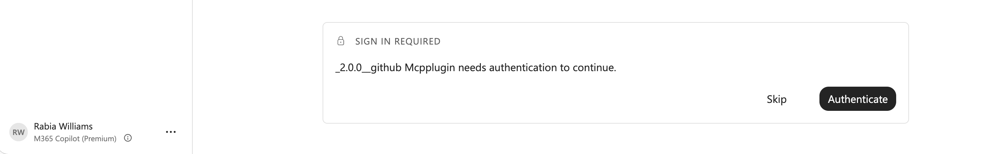
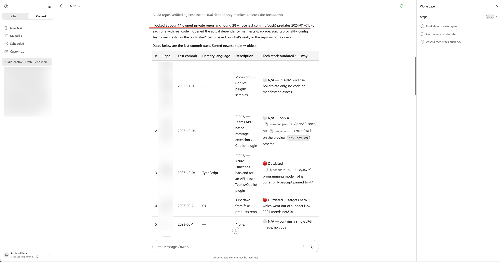

[← Back to Writing](/writing/)

# I Just Wanted to Audit My Stale GitHub Private Repos: So I Built an Authenticated Cowork Plugin

:material-clock-outline: **5 min read**

**I wanted to ask Cowork one question about my GitHub repos. Getting there meant teaching it to sign in as me.**

I had a simple ask for Cowork:

> "Find my private repos that haven't had a commit since before 2024-01-01. For each one, make a table with: repo name, last updated date, primary language, and one-line description. Then add a column flagging whether the tech stack looks outdated (e.g., unmaintained framework, EOL language version, dependency now widely deprecated) — and briefly say why."

That's not a hard question. I know the answer exists - it's sitting in my GitHub account. But Cowork couldn't see it, because there was no plugin connecting it to GitHub as *me*. Every connector I tried either didn't exist or worked anonymously - same result for me, you, or a stranger. Public repos only. My private stuff? Invisible.

So I built a plugin that signs in as me. This is the story of getting from "Cowork can't see my repos" to "Cowork just audited my entire private account and flagged the rot."


## Quick context: what's a Cowork plugin?

Copilot Cowork can be extended with plugins - small packages that teach it new tricks. A plugin bundles two things:

- **Skills** - plain-language instructions that tell Cowork *how* to do a task ("when someone asks to find a repo, do this")
- **Connectors** - the wiring to an external service, so Cowork can actually go fetch real data instead of guessing

The simplest connectors need no login at all - point at a public endpoint and you're done. Fine for public docs. Not fine for a question about *my* private repos.

## The first attempt: anonymous, and useless for this

My first version of this plugin pointed at GitHub with zero authentication. Ask it to find a popular open source repo - it did. Ask it to audit my private repos for stale tech stacks - nothing. It couldn't see what it wasn't allowed to see, because it never proved who was asking.

That's correct behavior. But it meant I couldn't ask my actual question. The whole point was the private stuff - which meant the plugin needed to sign in as *me*.

## What it took to get authentication working

Three moves from anonymous to authenticated. I put the finished plugin here if you want to see the real files: **[cowork-github-plugin](https://github.com/rabwill/cowork-github-plugin)**. Below is exactly what I did.

### Step 1: Register an OAuth App with GitHub

This is GitHub saying "yes, I'll vouch for whoever signs in through this app, and I'll tell you who they are."

1. Go to [github.com/settings/developers](https://github.com/settings/developers) and select **OAuth Apps** → **New OAuth App**.
2. Fill in the basics:
   - **Application name** - anything recognizable, e.g. `GitHub for Cowork`
   - **Homepage URL** - any valid URL, I used my plugin's repo
   - **Authorization callback URL** - this one matters, and it's always the same value no matter what you're building:
     ```
     https://teams.microsoft.com/api/platform/v1.0/oAuthRedirect
     ```
     This is the address Microsoft's side hands the login back to once GitHub says "yep, that's them." Get this wrong and sign-in just quietly fails.
3. Select **Register application**.
4. On the app's page, select **Generate a new client secret**. Copy both the **Client ID** and the **Client secret** somewhere safe right now - GitHub only shows you the secret once.

That's the whole GitHub side. Two values in hand: a client ID and a client secret.

### Step 2: Set up the OAuth registration in Teams developer portal

Now I needed somewhere for those two values to live that wasn't "hardcoded in my plugin files." That's what the Teams developer portal's OAuth client registration does - it stores the credentials securely and hands your plugin back a reference ID to point at instead.

1. Open the [Teams developer portal](https://dev.teams.microsoft.com/tools) and go to **Tools** → **OAuth client registration**.
2. Select **Register client** (or **New OAuth client registration** if you've got others already).
3. Fill in the form:
   - **Registration name** - something you'll recognize later, e.g. `github-mcp-oauth`
   - **Base URL** - `https://api.githubcopilot.com`, the GitHub MCP server's address
   - **Restrict usage by org** - `My organization only` while you're testing, or `Any Microsoft 365 organization` if this needs to work beyond your own tenant
   - **Restrict usage by app** - `Any Teams app` for now, you can lock it down later once your plugin has a stable ID
   - **Client ID** - paste the one GitHub gave you
   - **Client secret** - paste the one GitHub gave you
   - **Authorization endpoint** - `https://github.com/login/oauth/authorize`
   - **Token endpoint** - `https://github.com/login/oauth/access_token`
   - **Scope** - `repo read:user` (more on why `repo` specifically, below)
   - **Enable PKCE** - optional, turn it on if you want the extra layer
4. Select **Save**.
5. You'll get back an **auth config ID** - the portal currently labels it **OAuth client registration ID**. Copy it.

### Step 3: Point the plugin at it

That ID from Step 2 goes straight into the connector definition in `manifest.json` as in the sample I shared:

```json
"authorization": {
    "type": "OAuthPluginVault",
    "referenceId": "PasteyourOAuthVaultReferenceIdHere"
}
```

That's it. For anonymous this **type** is `None` but now for authenticated it is `OAuthPluginVault`. 
Paste your real reference ID where you see `PasteyourOAuthVaultReferenceIdHere` , and now every user who installs this plugin gets prompted to sign in with *their own* GitHub account before Cowork can use it on their behalf. Nowhere in that file is there a client secret sitting in plain text - just a pointer to where the real credential lives.

You can see the exact shape of this in my [manifest.json](https://github.com/rabwill/cowork-github-plugin/blob/main/manifest.json) - same connector block, just swap in your own reference ID.

## Upload the plugin to Cowork

Once the plugin is packaged and zipped, getting it into Cowork took about thirty seconds:

1. Open **Cowork** and select the **+** icon.
2. Scroll down to **Customize** (manage skills and plugins).
3. On the Customize page, upload the plugin zip file.

That's it - no "connect" step needed. Once uploaded, Cowork picks it up and you're ready to test.

The first time you prompt Cowork to use the plugin, it'll show a **Sign in required** card asking you to authenticate. Hit **Authenticate**, sign in with GitHub, and you're in - Cowork won't ask again after that.



## The moment of truth

With the plugin uploaded and authenticated, I asked the question I'd been building toward:

> "Find my private repos that haven't had a commit since before 2024-01-01. For each one, make a table with: repo name, last updated date, primary language, and one-line description. Then add a column flagging whether the tech stack looks outdated (e.g., unmaintained framework, EOL language version, dependency now widely deprecated) — and briefly say why."



It came back with a real table. Private repos I hadn't touched in over a year, flagged with outdated frameworks and EOL dependencies. Stuff anonymous access could never have surfaced - because it can't see a private repo no matter how nicely you ask.

That's when it stopped being a plugin project and became something I actually use.


## The caveat worth knowing

Remember that `repo` scope I set in the Teams developer portal back in Step 2? It's blunt on purpose - it's the only way a classic GitHub OAuth App can see private repos at all. There's no "read-only" version. Granting it technically hands the plugin write access too - push, delete, the works - even though all we asked it to do was search.

For a personal project or a demo, that tradeoff didn't bother me. Closer to production, I'd want to think harder about it.

## Why I bothered

I could have kept clicking through GitHub manually to figure out which repos were gathering dust. But I have a lot of repos, and "which ones use outdated tech" isn't a question GitHub's UI answers in one shot. Cowork answered it in one prompt - once it could actually see my account.

## If you want to do the same

The steps again, stripped down:

1. Register an OAuth app with whatever service you're connecting to
2. Register those credentials in the Teams developer portal and grab the reference ID
3. Flip the authorization type in your connector config
4. Ask a question only *your* login could answer

About five minutes of extra setup. Grab the full working plugin and swap in your own reference ID: **[github.com/rabwill/cowork-github-plugin](https://github.com/rabwill/cowork-github-plugin)**

## References

- [My sample plugin: cowork-github-plugin](https://github.com/rabwill/cowork-github-plugin)
- [GitHub - Creating an OAuth App](https://docs.github.com/en/apps/oauth-apps/building-oauth-apps/creating-an-oauth-app)
- [Teams developer portal](https://dev.teams.microsoft.com/tools)
- [Model Context Protocol](https://modelcontextprotocol.io/)

<!-- Global site tag (gtag.js) - Google Analytics -->
<script async src="https://www.googletagmanager.com/gtag/js?id=UA-146817327-1">
</script>
<script>
  window.dataLayer = window.dataLayer || [];
  function gtag(){dataLayer.push(arguments);}
  gtag('js', new Date());

  gtag('config', 'UA-146817327-1');
</script>
