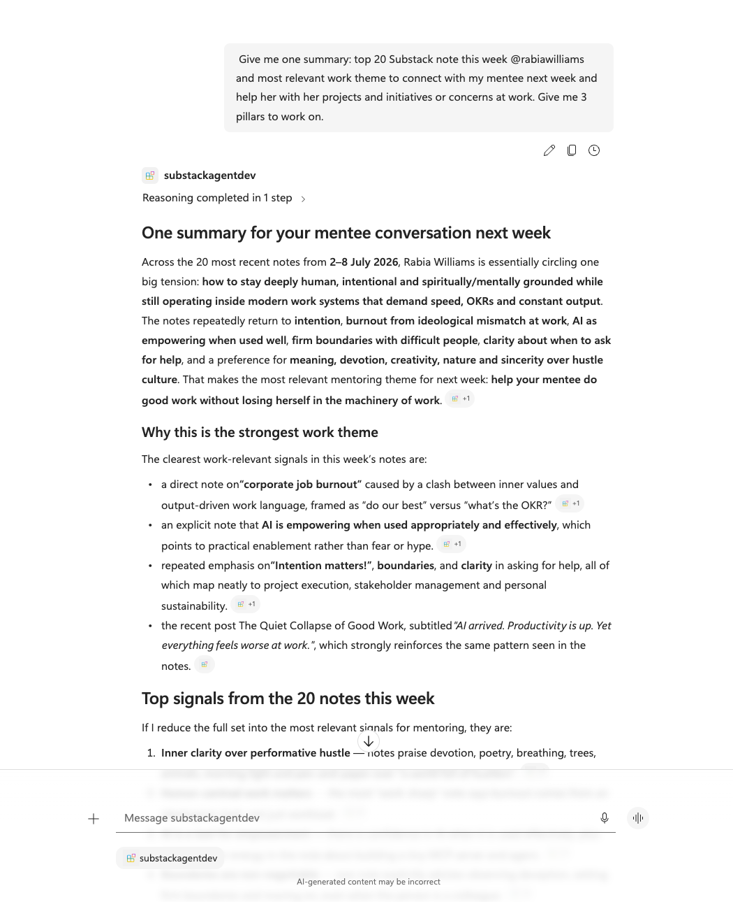
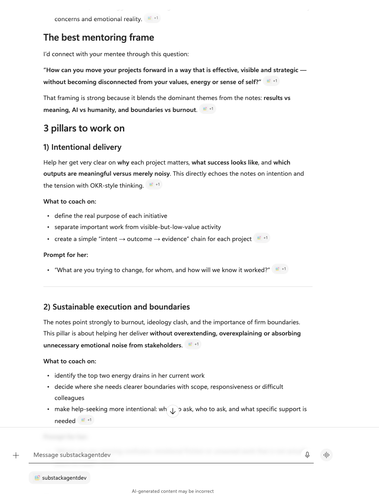
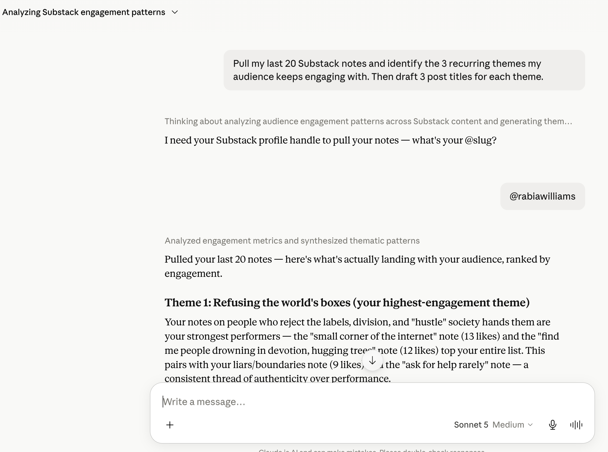
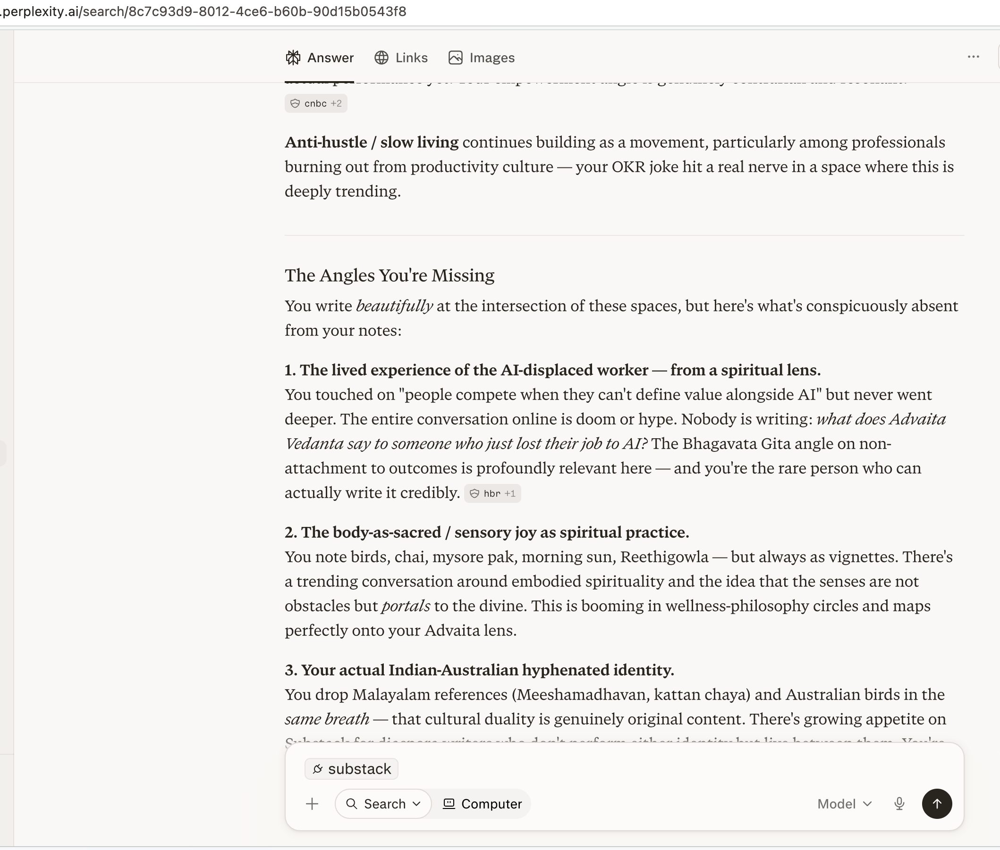
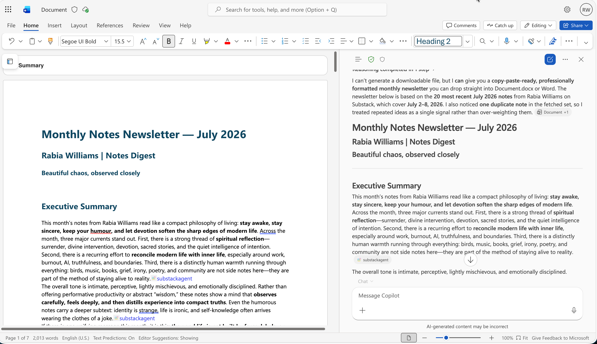

# Why I Built One Substack MCP Server for Four AI Apps

[← Back to Writing](/writing/)

:material-clock-outline: **3 min read**

**One server. Every AI app. No rebuilding.**

This post is based on the MCP server I built for my own workflow: analysing my Substack notes, spotting what people engage with most, and pulling every signal I can from Substack to shape what I write next. You can find it here: [substack-mcp](https://github.com/rabwill/substack-mcp).

Remember that drawer full of old chargers? One for a phone, one for a camera, one for headphones you do not even use anymore.

Then USB-C arrived. One connector. One cable. Everything works with it.

That is what MCP feels like for AI tools. The ecosystem keeps growing, but integration is getting simpler.

AI is having its USB-C moment, and you do not need to be a developer to see why it matters.

## So what actually is MCP?

The **Model Context Protocol (MCP)** is a standard way to plug your stuff - your notes, your files, your data, your tools - into any AI assistant that speaks it.

Before MCP, every AI app was its own island. If you wanted Copilot to see your data, you built one thing. Perplexity? Build it again. Claude? Again. It was the charger drawer all over again.

MCP flips that. You build **one server** that knows how to reach your information, and then *any* MCP-aware assistant can plug into it. Build once. Connect everywhere.

## One thing I built, four apps that understood it

To test this, I built a small MCP server that connects to my own Substack notes. I didn't rewrite it for each app. I built it once - then plugged the *same server* into four different tools and asked four different questions.

**Microsoft 365 Copilot** summarised my week and pulled the top signals out of my last 20 notes:

*Copilot in Microsoft 365 - turning 20 scattered notes into one clear summary.*

Then I asked it to go deeper, and it reframed the whole thing into a mentoring plan:

*...same server, a sharper question - no extra setup.*

**Claude** took the exact same notes and ranked the themes my audience keeps coming back to:

*Claude, pointed at the same server - ranking my highest-engagement themes.*

**Perplexity** looked at the same material and told me the angles I was *missing*:

*Perplexity - same notes, a completely different lens.*

And **Word** turned all of it into a finished newsletter, right inside the document:

*Word - where the insight becomes something I can actually publish.*

Same notes. Four different kinds of intelligence. That's the part that surprised me: the value wasn't only in my data - it was in letting each tool bring its *own* lens to it. And I only had to build the connection once.

## The Microsoft angle: your agent, right where you work

Here's the part I love as someone in the Microsoft 365 world. You don't have to build a whole AI system to use this.

With a **Declarative Agent**, you build on top of Copilot - its model, its orchestration, its familiar chat - and simply *declare* what your agent should know and do. Point it at your MCP server, and now your agent can reach your tools in plain language, right inside Teams, Word, and Copilot chat.

Your data and logic live in one place. Your agent lives where you already work. The plug does the rest.

## Why this matters - even if you never write code

Modern AI isn't about one clever chatbot. It's about your knowledge being **reachable from every place you work**, without duplicating effort every single time.

Build the capability once. Connect it everywhere. Let each assistant do what it's best at. Less busywork, more insight - and a lot less time lost to the digital equivalent of the charger drawer.

## Your turn

Curious to build one yourself? It's more approachable than you'd think.

Head to **[Copilot Developer Camp](https://microsoft.github.io/copilot-camp/)** and take the FREE **[MCP Foundations course](https://microsoft.github.io/copilot-camp/pages/extend-m365-copilot/bundle-a/)** that I wrote as part of my day job. In about four hours you'll:

1. **Run an MCP server and connect it to an agent in Copilot** - a full, working "ask in plain English, get real answers from your tools" flow.
2. **Secure the connection** - add OAuth 2.0 and Microsoft Entra ID, so only trusted requests ever reach your server.

Build it once. Plug it in everywhere. Ship it safely.

## References

- [Source code for substack-mcp](https://github.com/rabwill/substack-mcp)
- [Copilot Developer Camp](https://microsoft.github.io/copilot-camp/pages/extend-m365-copilot/)

---

<!-- Global site tag (gtag.js) - Google Analytics -->

